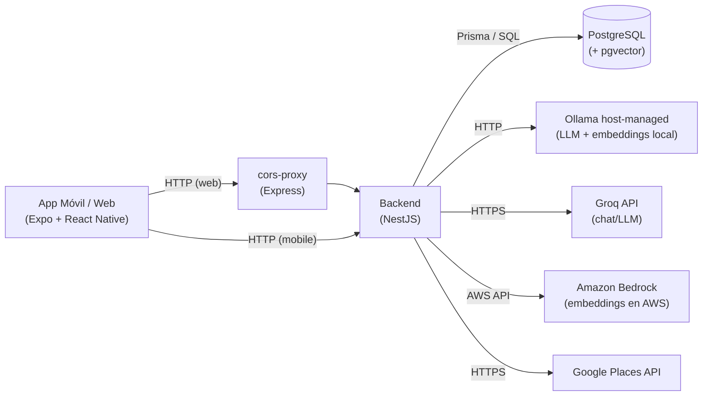
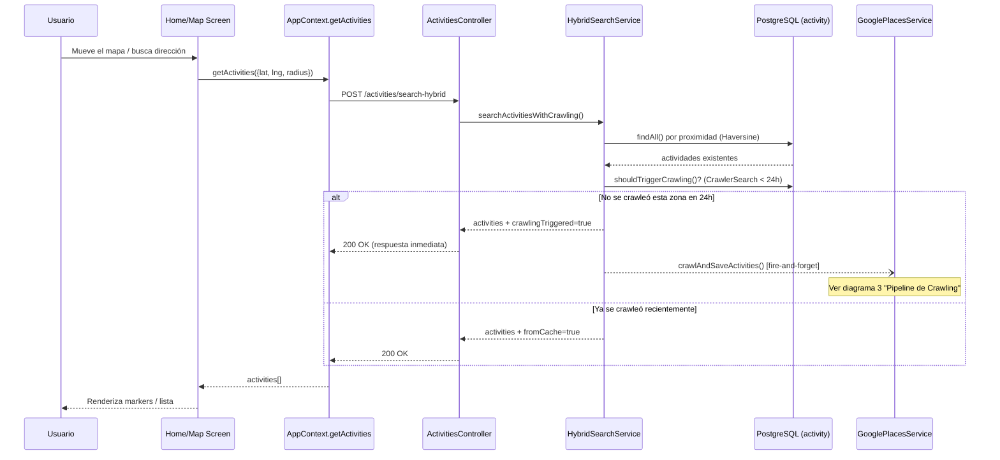
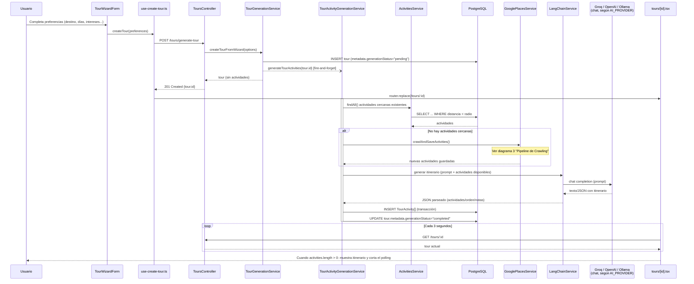
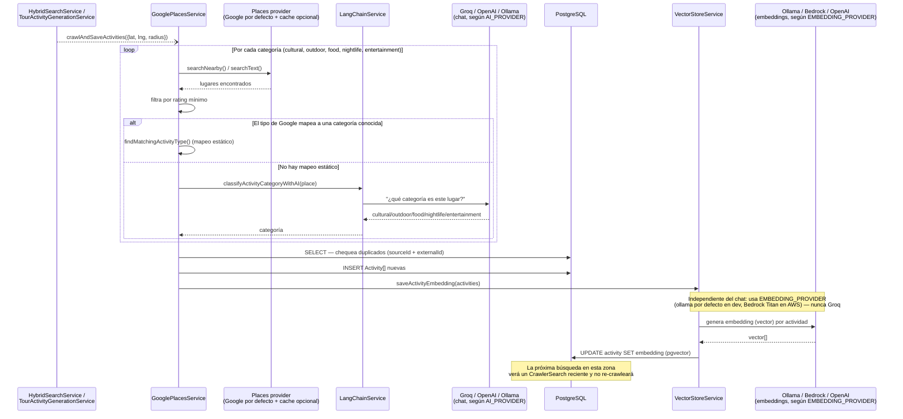
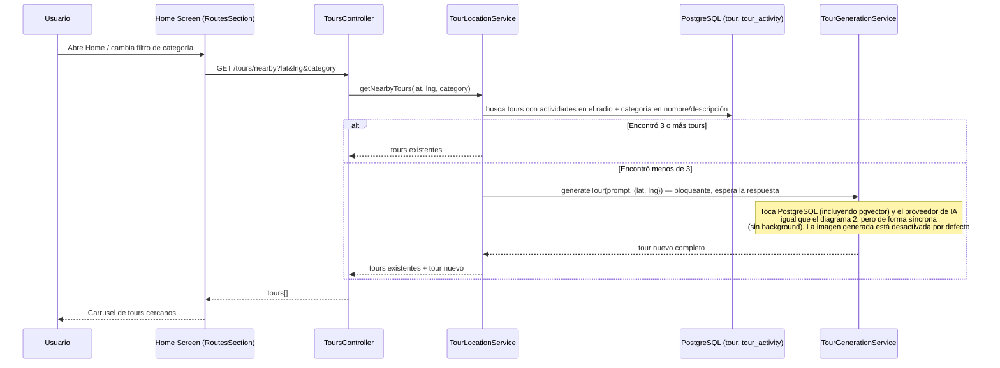

# Zig-Zag

A modern travel and exploration application that helps users discover places and activities using AI-powered recommendations.

## Project Structure

- `be/` - Backend service (NestJS)
- `fe/` - Frontend mobile application (React Native with Expo)

## Arquitectura y Casos de Uso

Esta sección explica cómo colaboran frontend y backend en los flujos principales, con diagramas de secuencia. Para el detalle de cada módulo backend hay READMEs dentro de `be/src/modules/*` y `be/src/shared/ai/`; para el frontend, `fe/api/README.md`, `fe/features/README.md` y `fe/context/README.md`.

### Documento canónico del Tour Engine

Antes de modificar generación de tours o Activities, destination resolution,
retrieval/ranking, embeddings, composites o integraciones Google Places/OSM,
leer [Activity Discovery and Tour Generation](./docs/architecture/activity-discovery-and-tour-generation.md).
El documento reúne los diagramas end-to-end, el rol de embeddings y Amazon
Bedrock, el refill multi-anchor de Places, la factibilidad espacial según el
transporte elegido y las invariantes que deben preservar tanto colaboradores
como agentes de IA. Describe la arquitectura objetivo; el repositorio actual
sigue siendo la fuente de verdad sobre qué partes ya están implementadas.

### Componentes principales

**Frontend (`fe/`)**

- `context/app.tsx` (`AppProvider`): estado global de la app — centro del mapa, actividades cacheadas, radio de búsqueda. Dispara `POST /activities/search-hybrid` cada vez que cambia el centro o la dirección buscada.
- `features/tours/use-create-tour.ts`: hook que arma el `GenerateTourDto` con las preferencias del wizard, llama a `POST /tours/generate-tour` y navega a `tours/[id]` con el tour recién creado (todavía sin actividades).
- `app/tours/[id].tsx`: pantalla de detalle. Al montar pide el tour por id; mientras `metadata.generationStatus` sea `pending`/`generating` y no haya actividades, hace polling cada 3s hasta que el backend termine (o falle).

**Backend (`be/src/`)**

- `modules/activities/services/hybrid-search.service.ts` (`HybridSearchService`): busca actividades existentes en PostgreSQL por proximidad y decide si dispara un crawling en background (si no se rastreó esa zona en las últimas 24h).
- `modules/integrations/google-places/google-places.service.ts` (`GooglePlacesService`): orquesta el refill mediante el proveedor configurado (`google` por defecto, `geoapify` explícito), con cache opcional por proveedor; guarda actividades nuevas y dispara la generación de sus embeddings.
- `modules/tours/services/tour-generation.service.ts` (`TourGenerationService`): crea el registro básico del tour (sin actividades) y dispara la generación en background sin esperar la respuesta (`createTourFromWizard`), o genera todo de una sola vez de forma síncrona (`generateTour`, usado por el descubrimiento de tours cercanos).
- `modules/tours/services/tour-activity-generation.service.ts` (`TourActivityGenerationService`): el "trabajador" en background — busca actividades existentes, dispara crawling si no hay, arma el prompt para el LLM (vía `AI_PROVIDER`), guarda las `TourActivity` generadas y va actualizando `metadata.generationStatus`.
- `modules/tours/services/tour-location.service.ts` (`TourLocationService`): busca tours existentes cerca de una ubicación con cierta categoría; si encuentra menos de 3, genera uno nuevo de forma síncrona vía `TourGenerationService.generateTour()`.
- `shared/ai/langchain.service.ts` (`LangChainService`): abstrae el proveedor de IA activo (OpenAI/Groq/Ollama) para chat y completions.
- `shared/ai/services/vector-store.service.ts` (`VectorStoreService`): guarda y busca embeddings de actividades en PostgreSQL (columna `vector(256)` + índice HNSW vía pgvector) para similitud semántica. En AWS los vectores los genera Bedrock Titan Text Embeddings V2 (256 dimensiones).

**Infraestructura (`docker-compose.yml`)** — los componentes "de verdad" detrás de los servicios de arriba:

- **PostgreSQL** (`postgres`): la única fuente de verdad relacional — `activity`, `tour`, `tour_activity`, `crawler_search`, etc. Accedida siempre vía Prisma (`PrismaService`), nunca directo. También guarda el embedding (vector numérico) de cada actividad vía la extensión `pgvector`, para poder buscar "actividades parecidas a X" por significado, no por texto exacto. La escribe/lee `VectorStoreService`.
- **Ollama** (servicio administrado por el host): sirve modelos LLM localmente. Se usa para generar embeddings (`nomic-embed-text`) por defecto en desarrollo, y opcionalmente para chat si `AI_PROVIDER=ollama`. Docker Compose no lo administra.
- **Groq** (API externa): proveedor de chat/LLM usado en AWS (`llama-3.1-8b-instant`). Ollama queda disponible para desarrollo local.
- **Amazon Bedrock** (API administrada de AWS): genera embeddings con Titan Text Embeddings V2 en producción. No requiere una cuenta ni tokens de OpenAI.
- **Places API** (Google Places como proveedor backend por defecto; Geoapify como alternativa explícita): fuente de datos reales de lugares/restaurantes/atracciones que alimenta la tabla `activity`. `USE_MOCK_MAPS=true` activa el wrapper de cache; `read` llama al proveedor real ante un miss y `strict` nunca lo hace.
- **cors-proxy**: proxy HTTP simple para que el frontend web esquive CORS al pegarle al backend.

### Diagrama de infraestructura (quién habla con quién)



Todo lo que sigue son "zooms" a pedazos específicos de este mapa, mostrando en qué momento entra cada una de estas piezas.

### 1. Búsqueda de actividades (Home / Mapa)

El flujo más frecuente: cada vez que el mapa cambia de centro o el usuario busca una dirección.



Punto clave: la request del usuario **nunca espera** al crawling — siempre devuelve lo que ya hay en la base, y el crawling (si corresponde) corre en background enriqueciendo la base para la próxima búsqueda.

### 2. Generación de tour desde el Wizard

Crear un tour completo puede tardar (llamada al LLM + búsqueda de actividades + crawling opcional), así que se resuelve de forma asíncrona con polling desde el frontend.



Nota sobre un bug real que encontramos y arreglamos: si `BgGen` falla (por ej. la API key de Groq inválida), marca `generationStatus="failed"` y guarda `generationError`, pero **no hay reintento automático** — hay que llamar manualmente a `POST /tours/:id/generate-activities` para reintentar. Además, el polling del frontend originalmente no se detenía nunca (bug corregido); ahora corta el `setInterval` apenas `generationStatus` deja de ser `generating`/`pending`.

### 3. Pipeline de Crawling de Google Places

Disparado en background tanto por la búsqueda híbrida (#1) como por la generación de actividades del tour (#2) cuando no hay suficientes actividades locales.



### 4. Descubrimiento de tours cercanos



## Prerequisites

- Node.js (v18+)
- Yarn
- Docker & Docker Compose
- Google Maps API key
- Expo CLI

## Setup

1. **Install dependencies**

   ```bash
   yarn install
   ```

2. **Environment Configuration**
   Copy the example environment file and fill in your values. The example file matches the current project configuration.

   ```bash
   cp .env.example .env
   ```

   _See `.env.example` for comments and details on each variable._

3. **Start Services**

   ```bash
   docker-compose up -d
   ```

   Requires a `.env` file (step 2). It sets `COMPOSE_PROFILES=dev`, which starts the local **PostgreSQL** container. Without it, use:

   ```bash
   docker-compose --profile dev up -d
   ```

   This command starts the following services:

   - **PostgreSQL**: Local database (Development), with the `pgvector` extension for AI embeddings
   - **Backend**: NestJS API
   - **Frontend**: Expo/React Native server
   - **Ollama**: Local host-managed LLM service (Docker Compose does not start it)

4. **🚀 Quick Start with Simulator** (Recommended)

   To generate the downloadable app for the simulator and start all services in one go, use the build script. This is the **fastest way** to get everything running.

   ```bash
   # Build for iOS Simulator (Default) and start services
   yarn simulator

   # Build for Android Emulator and start services
   yarn simulator:android
   ```

   This will:

   1. Install dependencies.
   2. Build the native app locally.
   3. Install it on your active Simulator/Emulator.
   4. Start Docker Compose (with backend, frontend, etc.).

   _Note: Standard `docker-compose up` works too, but you will need to manually install the app on your simulator or use Expo Go._

   > **Tip:** You can download the build from the EAS URL to install directly to the simulator. This saves time and avoids potential start up errors.
   >
   > https://expo.dev/accounts/juanobrach/projects/zig-zag/builds > **Warning:** If you add a new library, you must generate a new build for it to take effect.

5. **Initialize Database**
   Database migrations and setup are handled automatically when the backend starts.

## Available Scripts

- `yarn simulator` - **(Recommended)** Build for iOS Simulator + Start Stack
- `yarn simulator:android` - Build for Android Emulator + Start Stack
- `yarn ios` - Generate build for iOS Simulator
- `yarn start` - Run full stack in development mode
- `yarn start:be` - Run backend only
- `yarn start:fe` - Run frontend only
- `yarn test` - Run tests
- `yarn crawl` - Run location crawler
- `yarn eas-build` - Build for iOS (Frontend)

## Deployment

AWS es el destino principal: frontend privado en S3 + CloudFront, API vía CloudFront + ALB, backend en EC2, y PostgreSQL (con pgvector) en RDS. Ver [AWS_DEPLOYMENT.md](./AWS_DEPLOYMENT.md).

El entorno de desarrollo remoto queda apagado por defecto para ahorrar: `make aws-start`, `make aws-status` y `make aws-stop`. Detener conserva RDS; ALB, CloudFront, S3 y almacenamiento de RDS siguen existiendo y pueden tener costo residual.

## License

Private and unlicensed.
