# Activity Discovery and Tour Generation

> **⚠️ Filename and most of this document predate the Experience Domain V2
> rearchitecture.** The live runtime model is `GeoEntity` (physical reality:
> `PLACE`/`AREA`/`ROUTE`) + `Experience` (the only schedulable tourism unit) —
> `Activity`/`ActivityKind`/`TourActivity` no longer exist anywhere in the
> schema or runtime (removed by migration `20260902120000_remove_activity_domain_v2`).
> **Jump straight to [Experience Domain V2 cutover](#experience-domain-v2-cutover-2026-09-02)
> near the bottom of this file for the current authoritative flow, and to
> `CLAUDE.md` for a current, dense architecture summary.** Everything between
> here and that section — "Architectural invariants" through "Activity
> proposal boundary" — describes the pre-V2 design and is kept only as
> historical/design-rationale context; do not treat it as current behavior.
> Many of its underlying *principles* (catalog-first, discovery proposes but
> never supplies trusted identity, transport-aware feasibility, deterministic
> selection) still hold in V2, just expressed over Experiences/GeoEntities
> instead of Activities — see `CLAUDE.md` for how each maps forward.
>
> **Status:** Some V2 stages already exist and others are planned/tracked as
> known gaps (see `CLAUDE.md` and
> `docs/superpowers/plans/2026-09-02-experience-domain-v2-recovery-completion-plan.md`).
> The current repository remains the source of truth for implementation status.
>
> **Mandatory reading:** Read this document (the V2 cutover section, at
> minimum — the historical sections for background if you have time) before
> changing Experience/tour generation, candidate retrieval/ranking,
> embeddings, destination resolution, multi-component Experiences, Google
> Places/OSM integrations, or Experience Discovery.

This document describes how Zig-Zag transforms user preferences into a
grounded tour while growing a reusable catalog of neighborhood walks, food and
architecture walks, and route-based experiences.

Related documents:

- [Destination-aware activity engine design](../superpowers/specs/2026-08-21-activity-engine-design.md) — historical, pre-V2
- [Destination-resolution implementation plan](../superpowers/plans/2026-08-21-activity-engine-destination-resolution.md) — historical, pre-V2
- [Candidate quality, discovery, and mobility implementation plan](../superpowers/plans/2026-08-21-activity-engine-quality-discovery-mobility.md) — historical, pre-V2
- [Generation bitacora design](../superpowers/specs/2026-08-20-generation-bitacora-design.md) — Bitácora V3 superseded some of this; see `generation-trace.interface.ts`
- [Adquisición de candidatos: guía informal del flujo](./main-flow-for-dummies.md) — historical, pre-V2, introducción intuitiva a "Verified pool"
- [Experience Domain V2 recovery/completion plan](../superpowers/plans/2026-09-02-experience-domain-v2-recovery-completion-plan.md) — **current**, checkpoint-by-checkpoint status

## Vista de negocio y producto

Esta vista explica la lógica del producto, no las clases internas ni el estado
de implementación de cada PR. La mayoría de los tours recorre solamente la
línea principal. Completar el catálogo y descubrir experiencias son caminos
condicionales. No existe un proveedor universalmente primero: el catálogo se
consulta siempre; Places recupera y verifica entidades; grounded Discovery
aporta significado turístico, experiencias y un perfil inicial cuando Zig-Zag
todavía no conoce suficientemente un destino.

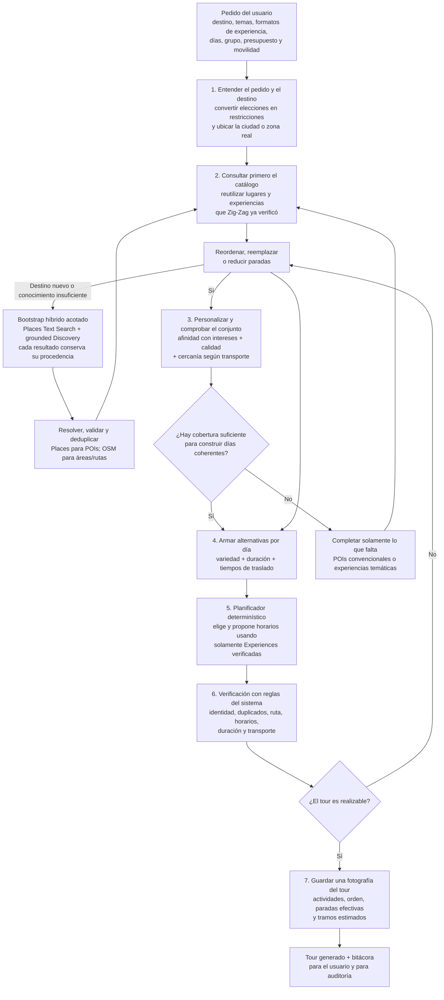

El ciclo de completar cobertura y el de corregir un itinerario son acotados.
Si después de los intentos permitidos no queda un conjunto real y realizable,
Zig-Zag informa el problema; nunca rellena el tour con lugares inventados.

### Por qué existe cada paso

| Acción                          | Por qué se ejecuta                                                                                                                                                                            | Resultado esperado                                                                                         |
| ------------------------------- | --------------------------------------------------------------------------------------------------------------------------------------------------------------------------------------------- | ---------------------------------------------------------------------------------------------------------- |
| Entender el pedido              | Intereses, ritmo y transporte significan cosas diferentes. Caminar como transporte, por ejemplo, no implica pedir una caminata temática.                                                      | Un criterio explícito para personalizar y comprobar factibilidad.                                          |
| Resolver el destino real        | Un nombre puede ser ambiguo y un radio alrededor de un punto puede representar mal una ciudad completa.                                                                                       | Ciudad/zona autoritativa o punto con radio, usados para desambiguar y contener resultados.                 |
| Consultar el catálogo primero   | Reutilizar entidades verificadas mejora consistencia, velocidad y costo, y evita repetir llamadas externas.                                                                                   | Pool inicial de POIs y experiencias reutilizables.                                                         |
| Personalizar                    | La similitud semántica aproxima qué actividades responden mejor a los intereses declarados.                                                                                                   | Actividades ordenadas por afinidad, sin confundir relevancia con verdad.                                   |
| Comprobar calidad y geografía   | Muchos resultados relevantes pueden estar demasiado separados, ser débiles o no formar un día posible para el transporte elegido.                                                             | Grupos candidatos con evidencia y coherencia espacial.                                                     |
| Analizar cobertura              | Evita llamar a proveedores solamente porque el ranking no es perfecto y evita aceptar un conteo alto pero inútil. También distingue catálogo conocido de destino todavía no perfilado.        | Decisión explícita: continuar, completar POIs, descubrir conceptos o inicializar conocimiento del destino. |
| Completar POIs convencionales   | Cuando faltan entidades concretas, Google Places Text Search puede recuperar atracciones relevantes y Nearby puede cubrir un tipo o zona faltante.                                            | Nuevos POIs admitidos únicamente después de validar identidad, evidencia y ubicación.                      |
| Descubrir significado turístico | Places devuelve entidades, pero no garantiza una lista completa de imperdibles ni propone bien experiencias como una caminata histórica. Un proveedor grounded propone conceptos con fuentes. | `ExperienceCandidate` con evidencia; todavía no es un Experience ni identidad confiable.                       |
| Resolver una propuesta          | El significado propuesto debe vincularse con un área, lugares, calles o caminos reales.                                                                                                       | Entidades verificadas con Google Places y OSM, o un rechazo explícito.                                     |
| Armar días                      | La selección final es un problema de conjunto: variedad, duración y traslados importan además del puntaje individual.                                                                         | Alternativas viables y acotadas por día.                                                                   |
| Selección y planificación determinísticas | El solver combina y calendariza únicamente Experiences verificadas; ningún LLM inventa ni selecciona unidades de agenda. | IDs de Experience y una propuesta compacta de agenda. |
| Verificación con reglas         | Una explicación convincente de la IA no demuestra rutas, horarios ni identidad.                                                                                                               | Tour corregido, reducido o rechazado según datos controlados por el backend.                               |
| Guardar una fotografía          | Las Experiences compartidas pueden evolucionar; un tour histórico no debe cambiar retroactivamente.                                                                                            | Orden, tramos y waypoints efectivos preservados al momento de generación.                                  |

### Qué debe expresar el wizard

El wizard no debe comprimir decisiones de producto distintas en un único
campo. En particular, estas tres elecciones son independientes:

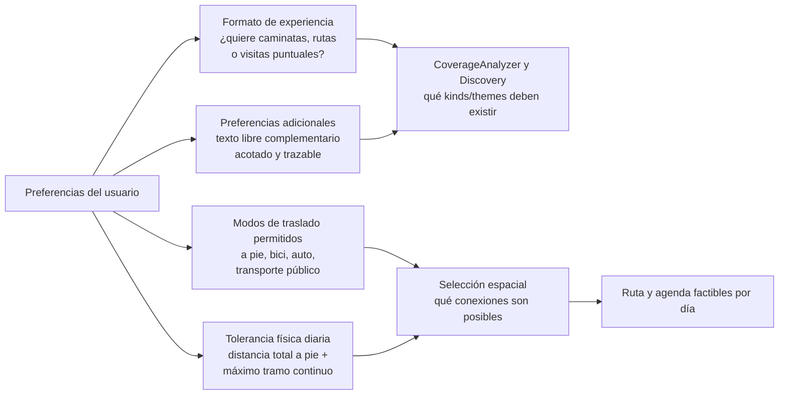

“Caminar” como modo de traslado no significa “quiero una caminata histórica”.
Del mismo modo, elegir una caminata temática no autoriza al motor a superar el
esfuerzo físico aceptado. El contrato canónico separa:

- `experienceFormats`: formatos deseados, por ejemplo visitas puntuales,
  caminatas de barrio, rutas temáticas y experiencias;
- `explorationStyle`: balance entre imperdibles, descubrimiento local y
  profundidad temática;
- `allowedTransportationModes`: modos que el planificador puede asignar a un
  tramo;
- `maxWalkingDistancePerDayMeters`: presupuesto acumulado de caminata por día;
- `maxContinuousWalkingDistanceMeters`: máximo aceptable para un único tramo
  peatonal;
- `travelPace` y restricciones de accesibilidad/grupo: modificadores de
  duración y factibilidad, no sustitutos de las distancias máximas.
- `additionalPreferences`: texto libre complementario para necesidades que el
  wizard todavía no modela de forma estructurada. Se recorta, valida, persiste
  y traza; nunca reemplaza restricciones tipadas ni convierte nombres o
  afirmaciones del usuario en entidades verificadas.

Para una primera UI conviene ofrecer perfiles comprensibles como “caminar lo
mínimo”, “moderado” y “me gusta caminar”, mostrando su equivalencia aproximada
en kilómetros por día y permitiendo personalizarla. El valor se aplica por día,
no al tour completo: un límite global sería ambiguo al comparar viajes de uno y
cinco días. Los rangos concretos son configuración de producto versionada y no
deben quedar ocultos dentro del prompt del LLM.

El texto libre no es un prompt alternativo ni una vía para evitar el contrato
canónico. Entra una sola vez al documento de intención que ve el selector de
itinerario; el ranking semántico puede incorporarlo a la consulta y el módulo de Discovery a los gaps
de Discovery. Las preferencias estructuradas son autoritativas cuando existe
un campo específico. Por ejemplo, una restricción alimentaria elegida en el
wizard no puede ser anulada escribiendo lo contrario en texto libre.

### Qué ocurre cuando falta cobertura

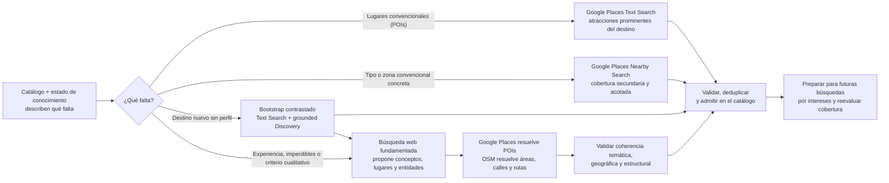

Text Search y Nearby Search son operaciones distintas de Google Places. Text
Search es la adquisición principal de POIs cuando existe una consulta turística
o temática concreta. Nearby es cobertura secundaria para un tipo o zona
faltante; no determina qué es imperdible y sus anchors nunca representan
relevancia turística. Ninguna crea composites. Una nueva composite nace de una
propuesta de Discovery, se resuelve contra entidades reales y se valida antes
de entrar al catálogo. Una composite que ya existe se reutiliza desde la
consulta inicial sin volver a descubrirla.

---

> ## ⚠️ HISTORICAL — pre-V2 Activity design, superseded
>
> Everything from here through **"Change checklist"** describes the
> `Activity`/`ActivityKind`/`TourActivity` model, which no longer exists in
> this codebase (removed by migration `20260902120000_remove_activity_domain_v2`).
> An "itinerary LLM" that "selects real Activity IDs" (invariant 6 below, and
> others) is also no longer accurate — V2 has **no LLM in ranking/selection/
> scheduling at all**, only a deterministic solver (see `CLAUDE.md`). Kept for
> design-rationale/history; skip to
> [Experience Domain V2 — provider boundaries](#experience-domain-v2--provider-boundaries)
> and [Experience Domain V2 cutover](#experience-domain-v2-cutover-2026-09-02)
> for the current flow.

## Architectural invariants

1. Query the existing catalog before external acquisition. This does not mean
   that a high row count proves destination knowledge: an unprofiled or stale
   destination may still require one bounded hybrid bootstrap.
2. Keep Destination Resolution and Activity Discovery separate.
3. Discovery proposes semantic ideas; it never supplies trusted coordinates,
   Google Place IDs, OSM IDs, or geometry.
4. Google Places and OSM supply authoritative identity and geometry.
5. Persist only fully resolved and validated Activities.
6. The itinerary LLM may select only real Activity IDs offered by the backend.
7. Embedding similarity is a relevance signal, not proof of identity or truth.
8. Semantic relevance and spatial feasibility are separate decisions. A set of
   strong semantic matches is not sufficient unless it forms a viable tour.
9. The user's allowed transportation modes must drive deterministic travel-time
   analysis, spatial grouping, per-day routing, and feasibility validation. A
   prompt instruction is not enforcement.
10. Coverage means enough relevant Activities that can form feasible per-day
    groups for the requested transport, pace, and duration; it is not a raw
    candidate count.
11. For the first transport release, Zig-Zag owns leg feasibility, the selected
    mode, and a conservative time/distance estimate. Google Maps owns live
    transit lines, transfers, and turn-by-turn navigation.
12. Composite Activities are reusable catalog Activities grouped into stable
    families and variants. Waypoint content is not variant identity.
13. TourActivityWaypoint stores the effective ordered waypoint set used by a
    tour so later variant edits do not rewrite that set.
14. OSM streets and paths must never be materialized as kind=POI.
15. ActivityWaypoint continues to reference reusable Activity rows. Do not add
    a GeoFeature table without a demonstrated requirement.
16. Waypoint lifecycle changes are explicit: merge, replace/remove, or archive
    rather than silently corrupting a composite.
17. Provider/index availability and LLM reasoning are not verification. The
    generation bitacora may claim a semantic, transport, opening-hours, or
    feasibility signal was applied only when the corresponding deterministic
    stage records evidence that it actually ran successfully.
18. Background itinerary generation uses a compact selection contract. The
    LLM returns offered IDs plus scheduling intent, not duplicated names,
    coordinates, distances, travel times, or tour totals. After ID
    verification, the backend rehydrates canonical identity and geometry from
    the exact offered catalog candidates. A provider's failed or truncated
    draft is never salvaged as a verified itinerary.
19. Catalog-refill anchors are ordered by POI density (number of existing
    catalog POIs within each candidate's bounding box), then by proximity to
    the destination center. This replaces the earlier farthest-first k-center
    algorithm, which maximized geometric spread at the expense of tourism
    relevance — producing anchors in peripheral, low-tourism areas while
    skipping central ones. Anchors remain bounded geographic API coverage:
    they are not evidence that a neighborhood is touristic or suitable for a
    composite. Nearby/anchor acquisition is secondary gap filling, not the
    primary source of must-see relevance.
20. No provider is universally the discovery entry point. Existing catalog,
    Places Text Search, grounded Discovery, Places Nearby, and direct entity
    resolution have explicit triggers based on destination knowledge and user
    intent.
21. A grounded proposal is recommendation evidence, not authoritative entity
    identity. Citations are retained, but Places/OSM resolution and backend
    validation remain mandatory before persistence or itinerary selection.
22. Experience intent, transportation permission, and physical tolerance are
    separate inputs. “Walking” cannot be inferred to mean both a thematic walk
    and permission for an arbitrary amount of pedestrian travel.
23. Replaced generation paths are deleted in the same delivery sequence. Do
    not retain global OSM-neighborhood ranking, duplicate selectors, dormant
    adapters, or indefinite compatibility flags as speculative fallbacks.

## End-to-end flow

The primary architecture is intentionally expressed as five stages. Provider
calls, validation gates, and retry paths are conditional zooms into these
stages; they are not fourteen mandatory network calls on every tour request.

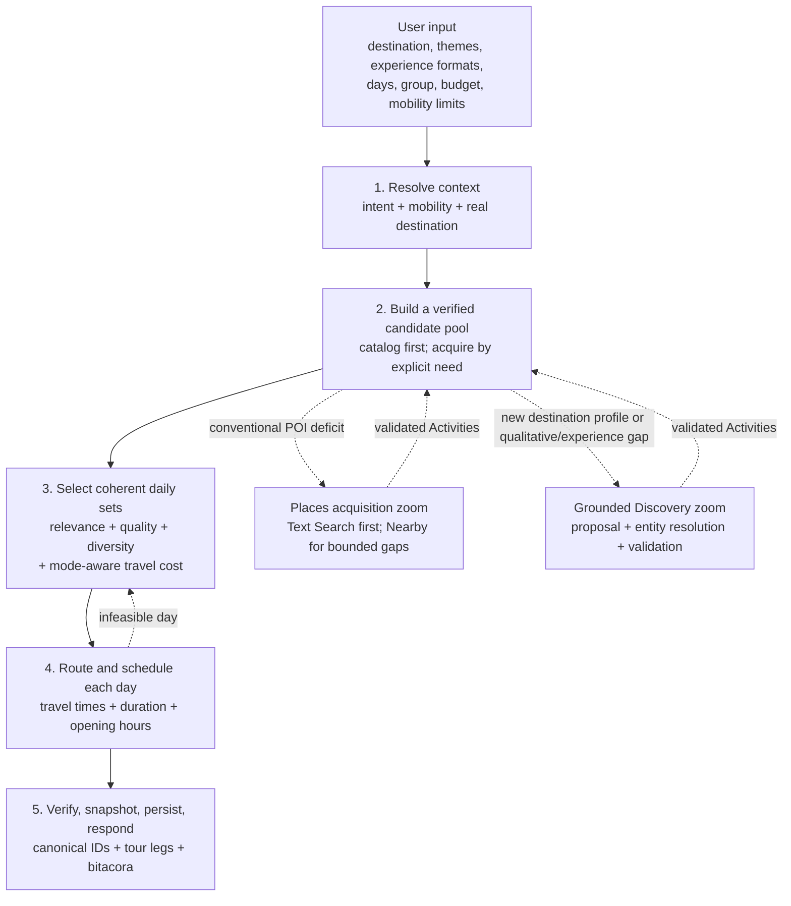

The catalog-growth loop does not mean that every generation crawls providers.
A healthy, already-profiled destination normally stays on the main line:
resolve, query the catalog, select, schedule, and persist. A previously unknown
destination may run one bounded bootstrap that contrasts Places POIs with
grounded recommendations; the resolved result is cached/reused. Later calls
are gap-driven and add only validated reusable Activities before reevaluation.

### What runs always and what is conditional

| Stage                  | Always on the generation path                                                                                                                | Conditional work                                                                                                                                                                                                                                                                 |
| ---------------------- | -------------------------------------------------------------------------------------------------------------------------------------------- | -------------------------------------------------------------------------------------------------------------------------------------------------------------------------------------------------------------------------------------------------------------------------------- |
| 1. Resolve context     | Normalize preferences and mobility; build a `DestinationContext` through Nominatim forward/reverse resolution.                               | Query Overpass for an authoritative boundary when the destination resolves as a city/neighborhood rather than a point.                                                                                                                                                           |
| 2. Verified pool       | Query eligible `POI`, `ROUTE`, `NEIGHBORHOOD_WALK`, and `EXPERIENCE` Activities from PostgreSQL and inspect destination-knowledge freshness. | Use direct Places resolution for named entities; Text Search for conventional POI gaps; Nearby for bounded type/zone gaps; grounded Discovery for a new destination profile, must-see/qualitative uncertainty, or missing experiences. Resolve all proposals through Places/OSM. |
| 3. Daily sets          | Apply semantic relevance, quality, diversity, and deterministic spatial feasibility to real Activity IDs.                                    | Generate a query embedding only when the configured embedding provider/index is available; report semantic ranking as unavailable and use documented non-semantic signals when it is not.                                                                                        |
| 4. Route and schedule  | Order each day and validate travel, activity duration, and available opening-hour constraints.                                               | Reselect, split, or remove stops when a day is infeasible. Detailed live transit/navigation remains outside the MVP.                                                                                                                                                             |
| 5. Persist and respond | Verify offered IDs, hydrate canonical data, persist `TourActivity` and effective `TourActivityWaypoint` snapshots, and emit the bitacora.    | Persist a newly validated composite only when the selected tour actually uses it or the catalog-growth policy explicitly materializes it.                                                                                                                                        |

### Provider-call guide

`Google Places` is the provider/API family. `Text Search` and `Nearby Search`
are two different Google Places operations with different purposes. Neither is
a fallback for the other.

| Call                                     | Exact trigger                                                                                                 | Problem it solves                                                                                                                                                      |
| ---------------------------------------- | ------------------------------------------------------------------------------------------------------------- | ---------------------------------------------------------------------------------------------------------------------------------------------------------------------- |
| Nominatim forward/reverse                | Stage 1, for destination resolution                                                                           | Disambiguates the user's label/coordinates into a normalized real place.                                                                                               |
| Overpass boundary                        | Stage 1, for an area-scale destination                                                                        | Supplies authoritative city/neighborhood containment geometry. It does not rank tourism and is not a routing engine.                                                   |
| Google Places Text Search                | Stage 2, for a conventional POI gap, new-destination bootstrap, or exact named-entity resolution              | Retrieves real Places candidates ordered by the provider's query relevance. It often finds iconic POIs, but is not treated as a complete curated must-see list.        |
| Google Places Nearby Search              | Stage 2, only for an explicit missing type/zone that needs bounded geographic coverage                        | Provides typed coverage using primary types, popularity, and hard circles. It is secondary to intent-driven Text Search; an anchor is coverage, not tourism relevance. |
| Geoapify category search                 | Stage 2, only when Geoapify is explicitly configured instead of Google                                        | Provides the category-based coverage that Geoapify actually supports; it does not imitate Google's Text Search.                                                        |
| Bedrock Titan / local Ollama             | Stage 3, when semantic retrieval is requested                                                                 | Produces query and Activity embeddings consumed by pgvector. Failure is explicit and never switches provider silently.                                                 |
| Grounded Discovery provider              | Stage 2, for an unprofiled/stale destination, qualitative must-see uncertainty, or a missing experience/theme | Proposes sourced `ActivityProposal` concepts and entity hints. It is one recommendation signal, not trusted identity or geometry and not an always-first provider.     |
| Google Places proposal resolution        | Only for discovered POI/venue hints                                                                           | Resolves a proposal hint to a real provider entity before validation.                                                                                                  |
| Nominatim + Overpass proposal resolution | Only for discovered streets, paths, routes, neighborhoods, or boundaries                                      | Resolves non-POI proposal hints and composite geometry.                                                                                                                |
| Wikidata/Wikipedia                       | Optionally, only when a resolved OSM entity has a QID                                                         | Adds narrative context. Missing narrative never invalidates the entity.                                                                                                |
| Configured itinerary LLM                 | Stage 3, after a feasible candidate window exists                                                             | Selects offered IDs and scheduling intent only; the backend verifies and rehydrates them.                                                                              |
| Travel-time provider                     | Stages 3-4, for bounded candidate pairs and final legs                                                        | Supplies mode-aware deterministic time/distance. OSM/Overpass data alone does not calculate a route.                                                                   |

When both are explicitly planned, Text Search and Nearby results are united
before the same geography, deduplication, identity, and admission gates.
Nearby is not an automatic retry after Text Search failure. Detailed request
shapes and evidence gates appear in
[Catalog Refill with destination anchors](#catalog-refill-with-destination-anchors).

Provider labels are explicit calls, not automatic fallback chains. If Google
is selected for Places, a failure does not invoke Geoapify. If Bedrock is
selected for embeddings, a failure does not invoke Ollama or OpenAI.
The configured LLM provider may change behind its adapter; the trace must
record which provider actually handled the operation.

### OSM composite resolution

The target path starts with one concrete grounded/reusable proposal. OSM does
not enumerate a city and decide which neighborhood tourists should want.

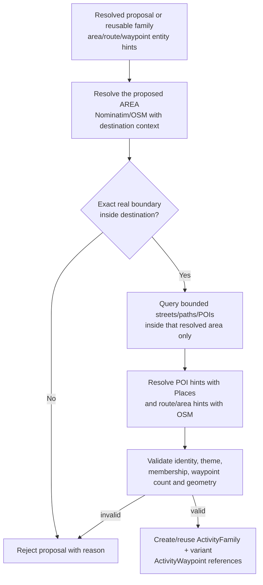

The target JSON-mode itinerary contract requires only `reasoning` and
`activities`. Every pick carries an offered reusable `activityId`,
day/time/duration, a bounded short note, and an optional verified waypoint
subset when that ID is an existing composite. It does not contain a
`compositeActivities` creation channel: new composites enter the catalog only
through grounded proposal resolution before itinerary selection. Server-owned
values are populated only after the anti-hallucination check. This prevents
long multi-day responses from spending the completion budget repeating
candidate data and then truncating before the JSON object closes. A
`json_validate_failed` draft does not enter the repair, verification, or
persistence path. If a later explicit retry succeeds, its non-failed status
removes the previous attempt's `generationError` and `generationFailedAt`;
stale failure metadata must not survive a completed run.

The old city-wide OSM enumeration and `CompositeAreaSelector` path is not a
supported fallback. It must be removed when this architecture is adopted, not
retained behind an indefinite feature flag. A temporary release may therefore
reuse existing catalog composites without creating new ones until grounded
proposal resolution is ready. That loss of speculative composite generation is
preferable to persisting plausible-sounding walks through arbitrary barrios.

Exact membership and boundary-hydration code belongs in the proposal resolver
only when it has an immediate production consumer. Do not commit unused
“future” abstractions merely because an earlier experiment implemented them.

Administrative ways that also carry `highway=*` are not neighborhood areas. A
way boundary is eligible only when it is a closed area. Street-name
placeholders remain ineligible for composite proposal or persistence.

Wikidata does not enrich every Google/Geoapify POI. It adds optional narrative
grounding only to already resolved OSM entities in a concrete proposal. A safe
extract may be stored as a composite `narrativeSource`; it
does not overwrite catalog POI prose. Missing QID, failed enrichment, or a
failed safety check removes only the optional narrative, not the candidate.

### Production topology: cold-destination OSM refill

The public Nominatim and Overpass community endpoints are not a mass-production
capacity layer. Retry, concurrency, and circuit-breaker logic protect the
application and those services, but cannot provide an SLA. At production
volume, normal tour requests should primarily reuse resolved OSM-backed
Activities from Zig-Zag's catalog.

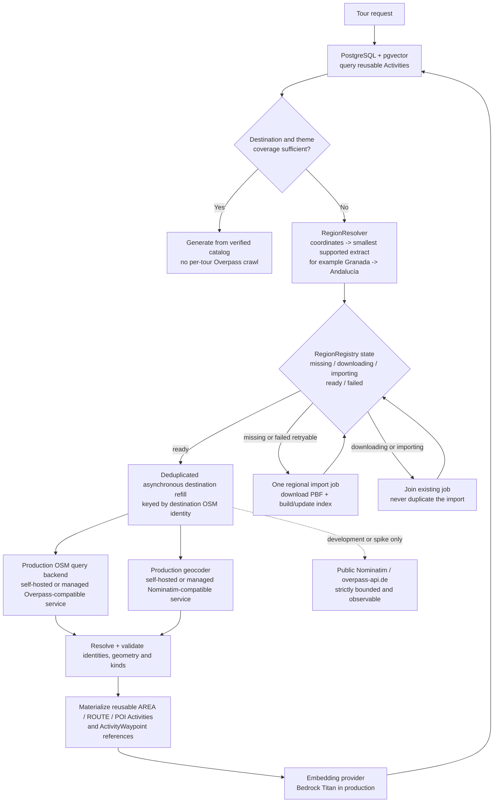

This production topology is a required gate before enabling OSM-backed
composite generation at mass scale. It does not require a `GeoFeature` table:
resolved entities continue to use `Activity`, `ActivityFamily`, and
`ActivityWaypoint`. The refill worker and production OSM hosting/provider remain
bounded by environment; the repository remains the source of truth.

The critical boundary is:

```text
Discovery proposes meaning.
Entity Resolution supplies identity.
Validation authorizes persistence.
Tour Generation only selects verified Activities.
```

## Stage responsibilities

| Stage                        | Responsibility                                                                                                                                           | Must not do                                                             |
| ---------------------------- | -------------------------------------------------------------------------------------------------------------------------------------------------------- | ----------------------------------------------------------------------- |
| UserIntentBuilder            | Normalize destination and preferences                                                                                                                    | Resolve external entities                                               |
| MobilityProfileBuilder       | Convert allowed transport, pace, days, and accessibility needs into routing constraints                                                                  | Treat every mode as walking or rely on prompt text                      |
| DestinationResolutionService | Normalize structured locality/country context, classify point vs area, validate the result against destination coordinates, and build DestinationContext | Blindly trust a provider-specific display label or discover experiences |
| ExistingActivityRetriever    | Retrieve geographically valid catalog Activities                                                                                                         | Call a discovery LLM                                                    |
| PlacesAcquisitionPlanner     | Choose direct resolution, Text Search, or bounded Nearby from the explicit POI deficit and provider budget                                               | Treat Nearby anchors or provider rank as a definitive must-see list     |
| SpatialFeasibilityAnalyzer   | Build mode-aware travel-time relationships and viable per-day candidate groups                                                                           | Use semantic similarity as a proxy for proximity                        |
| CoverageAnalyzer             | Measure quantity, themes, kinds, quality, destination-knowledge freshness, and transport-feasible per-day coverage                                       | Treat a raw candidate count as sufficient or persist Activities         |
| ActivityDiscoveryService     | Request sourced missing concepts or a bounded new-destination profile from a grounded provider                                                           | Act as authoritative identity, access Prisma, or persist output         |
| Entity Resolution            | Resolve hints through Places/OSM with destination context                                                                                                | Trust LLM identity or coordinates                                       |
| ActivityValidator            | Enforce semantic, geographic, structural, and transport rules                                                                                            | Repair by guessing                                                      |
| CompositeActivityService     | Reuse/persist validated area, family, variant, and waypoints                                                                                             | Persist raw proposals                                                   |
| Unified Ranking              | Select coherent candidate sets using relevance, quality, diversity, and travel cost                                                                      | Rank each Activity independently and ignore the resulting route         |
| Itinerary generation         | Choose and schedule offered Activity IDs                                                                                                                 | Create entities                                                         |
| Verification                 | Drop hallucinated IDs, duplicates, invalid subsets, and infeasible schedules                                                                             | Trust prompt compliance                                                 |

Here, **diversity means marginal non-redundancy within the selected set**, not
random variety. Set-level selection rewards an uncovered requested theme or
requested experience format and softly penalizes near-duplicate semantic
content or excessive repetition of one normalized subtype. It must not spread
stops across the city, require every Activity kind/provider, or select a weaker
irrelevant place merely to satisfy a quota. Geographic coherence remains a
separate feasibility constraint, and food/drink cadence remains the deferred
role-aware design below.

Destination resolution must not assume that the frontend display label is a
canonical Nominatim query. For example, the provider label `Montevideo,
Montevideo Department, Uruguay` can return no Nominatim result while the
structured locality/country query `Montevideo, Uruguay` resolves the real city
relation. A bounded fallback must be built from structured destination
components and disambiguated with the selected coordinates and country; it
must not remove arbitrary comma-separated components and accept the first
result blindly. A non-empty forward response is not proof of a valid match:
if all returned POIs/buildings are geographically inconsistent with the
coordinates selected in the wizard, the flow treats the label as ambiguous
and runs the same reverse normalization. A selected address or specific POI
remains point-scale and does not trigger city exploration.

That last distinction cannot depend only on Nominatim successfully recognizing
the same fine-grained entity. The autocomplete provider already knows whether
the user selected a settlement or a specific POI/address, but the current
frontend drops that structured type and sends only label, coordinates, and
radius. The canonical intent contract must preserve a provider-neutral
destination-scale hint. A verified point hint prevents reverse normalization
from silently widening a selected address/POI into a city; a settlement hint
still requires coordinate-validated Nominatim identity and authoritative OSM
boundary hydration. Neither hint supplies trusted boundary geometry.

Accommodation discovery and lodging recommendations are outside the current
product scope. Lodging provider types must not become tour Activities merely
because they are returned by a broad Places query; they require an explicit
future product decision and a separate role in the domain.

## Deferred design topic: food and drink stops

Food and drink venues need role-aware scheduling; they must not be treated as
interchangeable sightseeing POIs. This is intentionally deferred until the
provider, catalog-quality, discovery, and mobility foundations are stable.

The later design must distinguish at least:

- a general or mixed tour, where a meal, coffee, or snack is a schedule-support
  stop and repeated consecutive venues are normally invalid; and
- an explicitly food-centric experience, such as a tapas, market, tasting, or
  cafe walk, where multiple verified food venues are the primary experience.

Merely including `food` among several wizard interests must not automatically
make a tour food-centric. The design also needs to account for meal windows,
opening hours, duration, budget and dietary constraints, geographic coherence,
and the user's explicit intent. Route optimization must preserve those roles
and schedule constraints rather than globally reordering all selected
Activities only by geographic distance.

The Granada regression case—three cafe/coffee venues selected consecutively in
a mixed history, food, culture, and architecture tour—must become an acceptance
fixture when this work is implemented. No ad-hoc per-type cap is part of the
current provider/cache stabilization scope.

## Deferred design topic: city-and-surroundings excursions

The first engine iteration deliberately treats an authoritative city boundary
as a hard eligibility constraint. This prevents a broad provider query or a
semantic match from pulling unrelated distant Activities into an urban tour.
It also means that important regional experiences outside the municipality are
not yet eligible. For example, a San Juan city tour can legitimately omit the
Dique de Ullum even though it may be an important experience for a visitor to
the wider destination.

This must be implemented as an explicit later product capability, not by
silently enlarging every city radius or weakening destination containment:

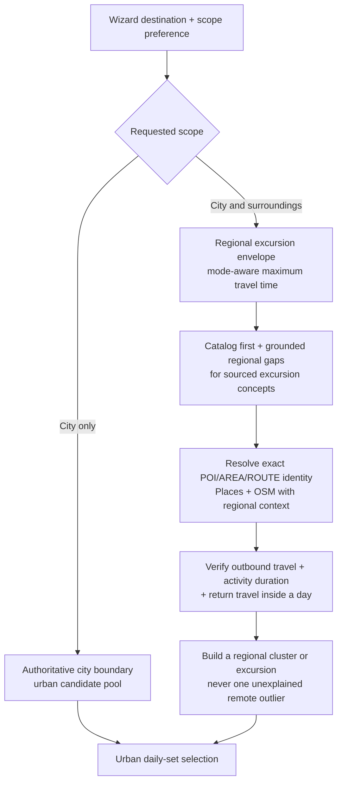

The later wizard contract must distinguish `city only` from `city and
surroundings` and capture a maximum acceptable excursion travel time or an
equivalent half-day/full-day preference. Eligibility must use deterministic
travel time for the user's allowed modes; embeddings may rank a resolved
regional Activity by theme, but cannot authorize crossing the urban boundary.

Activities remain reusable geographic entities and are not duplicated for
each nearby city. The tour-generation context decides whether an Activity is
inside the urban core or is a reachable regional excursion. A remote Activity
should normally enter the schedule as a coherent excursion/cluster with
outbound and return legs, not as an isolated POI mixed into an otherwise urban
day.

This capability is intentionally scoped for future iteration.
The tour intent contract, grounded proposal and resolution boundaries,
and daily planning travel-time contracts are prerequisites, but none should
pretend to support regional excursions until the separate acceptance criteria
are implemented.

## Embeddings in the engine

Embeddings participate in retrieval, coverage analysis, semantic deduplication,
and unified ranking. They measure semantic relevance; they do not determine
whether a group of Activities can be visited efficiently.

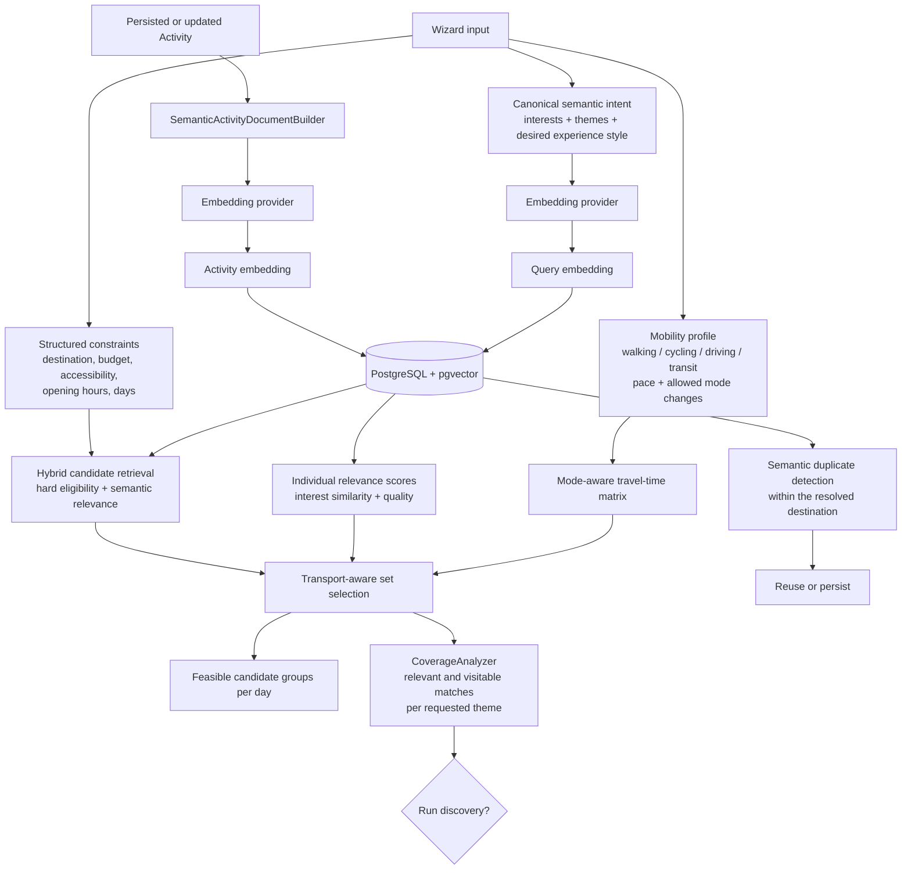

Hard constraints run before semantic scoring: destination boundary/radius,
archive status, allowed Activity kinds, and deterministic budget,
accessibility, or operating constraints. This prevents a semantically similar
Activity in the wrong city from entering the pool. Transport mode is not text
to append to the embedding as a substitute for routing; it creates concrete
travel-time and feasibility constraints after relevant candidates are found.

All providers must embed the same canonical Activity document. For a composite
it should include verified name, kind, themes, area, duration, and waypoint
names/types. Coordinates, external IDs, ratings, and review counts are separate
identity, geographic, and quality signals and do not belong in semantic text.
Group and pace belong in the semantic document only when the Activity document
contains corresponding suitability information. Otherwise they remain
structured selection and scheduling signals.

Regenerate an Activity embedding when its semantic content changes. Embeddings
must not decide destination identity, Google/OSM identity, or anti-hallucination
verification.

## Amazon Bedrock's current role

Zig-Zag uses Amazon Bedrock as an embedding provider in production, not as the
chat or discovery provider. Titan Text Embeddings V2 produces the vectors
stored in PostgreSQL. Chat and itinerary generation remain behind the separate
OpenAI/Groq/Ollama abstraction.

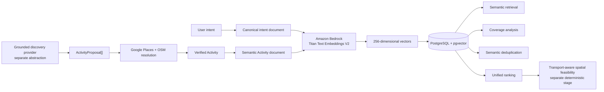

Vectors from different embedding models are not interchangeable even if their
dimensions match. Track provider/model/version and rebuild the full index when
switching models. Do not silently mix Titan and OpenAI/Ollama vectors.

`EMBEDDING_PROVIDER` is authoritative. An embedding-provider failure must
never select another provider automatically, regardless of which API keys are
present. The engine may retry the same provider under a bounded policy; if it
still fails, embeddings become explicitly unavailable for that operation and
retrieval degrades to the documented non-semantic signals. Changing provider
or model is an operator action followed by a complete index rebuild.

Local development uses Ollama with `nomic-embed-text`; production uses Bedrock
Titan. Both store vectors in PostgreSQL with pgvector. ChromaDB is not part of
the current architecture. Local Ollama tests validate the pipeline but do not
claim numerical parity with Titan.

The Prisma column is currently vector(256). Production configuration must stay
at 256 dimensions unless a schema migration and complete index rebuild happen
together.

### Current embedding/retrieval implementation checkpoint

Semantic retrieval is implemented as follows:

- `SemanticActivityDocumentBuilder` is the only document builder used by
  Activity embedding writes. It includes verified semantic fields and
  composite waypoints, while excluding coordinates, provider IDs, ratings, and
  review counts.
- Each stored vector carries provider, model, dimensions, document version,
  and generation time. Similarity queries use only an exact match with the
  configured index identity; legacy or mixed vectors are explicitly missing.
- `EMBEDDING_PROVIDER` is strict. Bedrock, Ollama, and OpenAI failures produce
  an unavailable state and never activate another provider.
- The current application rejects any configured vector width other than 256.
  A failed full rebuild clears its partial batches, so a provider/model switch
  cannot leave an incomplete index presented as authoritative.
- Catalog retrieval first builds the geographically eligible pool (bounded at
  250 rows for the current request path), then runs pgvector across that pool,
  and only afterwards selects the 15 candidates offered to the itinerary LLM.
  This replaces the old rating-top-20-then-embedding order.
- Measured semantic candidates compete on relevance plus bounded quality,
  proximity, kind, and subtype non-redundancy signals. Candidates without a
  compatible embedding remain an explicit unknown tier ordered by quality and
  proximity; they are not assigned a synthetic zero similarity.
- The bitacora records `not_requested`, `applied`, or `unavailable` from the
  actual similarity operation, together with eligible, compatible-indexed, and
  offered counts.

The 250/15 bounds are operational limits, not coverage policy. `CoverageAnalyzer`
replaces any raw minimum-count refill decision, while the candidate selection window
and daily planning solver own set-level diversity and deterministic transport feasibility.
Semantic retrieval does not claim that semantic relevance alone proves a day is
geographically realizable.

## Transport-aware spatial feasibility

Semantic ranking answers whether one Activity matches the user's interests.
Spatial feasibility answers whether a set of matching Activities forms a good
tour. This is a set-level decision: distance from each Activity to the
destination center is not enough because the travel cost between Activities
determines the actual itinerary.

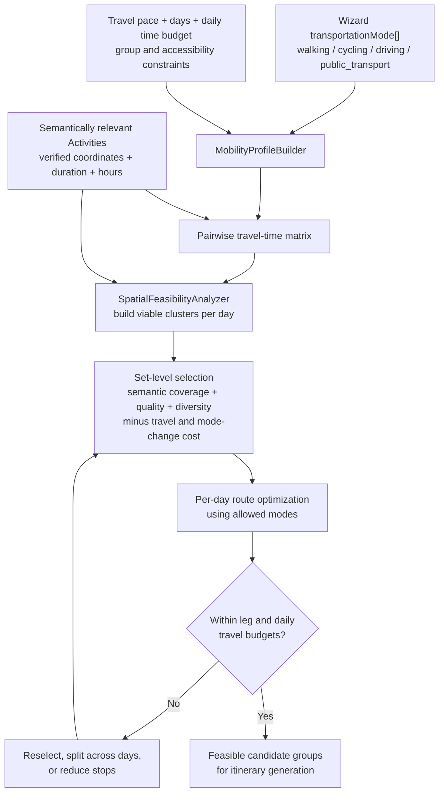

The matrix should represent travel time and operational friction, not only
straight-line distance:

| Mode               | Required signals                                                                       |
| ------------------ | -------------------------------------------------------------------------------------- |
| `walking`          | Pedestrian route, crossings, slopes, accessibility, maximum leg and daily walking time |
| `cycling`          | Cycle-suitable route, bicycle infrastructure, slopes, parking, maximum riding time     |
| `driving`          | Road route, expected traffic, parking location, parking/search overhead                |
| `public_transport` | Stops, schedules/frequency, waiting, transfers, and walking access/egress              |

OSM and Overpass do not themselves calculate these routes. Overpass is the
read-only OSM data-query backend; an OSM-backed `TravelTimeProvider` requires a
routing engine such as OSRM, Valhalla, GraphHopper, or another reviewed
adapter. Likewise, do not model public transport as one Google
`optimizeWaypointOrder` call: Google Routes transit requests do not support
intermediate waypoints. The MVP may use supported pairwise transit legs or an
explicit conservative estimate and then hand live navigation to Google Maps.
References: [Overpass API](https://wiki.openstreetmap.org/wiki/Overpass_API),
[OSM routing engines](https://wiki.openstreetmap.org/wiki/Web_front_end/Routing),
and [Google transit routes](https://developers.google.com/maps/documentation/routes/transit-route).

Daily grouping is an outcome contract, not a commitment to K-Means with
`K = days`. A valid implementation must use travel-time cost, Activity
duration, daily capacity, opening hours, and start/end constraints. Similarly,
ordering is a scheduling problem rather than pure geometric TSP; the shortest
coordinate order can still be an invalid day.

When the wizard allows multiple modes, the engine may choose a mode per leg but
must penalize excessive mode changes. Thresholds must derive from travel time,
pace, day duration, and destination context rather than one global kilometer
radius.

Coverage analysis runs after this stage. Twenty strong semantic matches can
still mean insufficient coverage when only three form a viable walking cluster.
For multi-day tours, coverage should be expressed as one or more coherent
geographic groups per day. Discovery is triggered only for themes or quantities
missing from those feasible groups, not merely because candidates are spread
across the destination.

### Accepted MVP transport contract

For the first transport-aware version, every transition between consecutive
Activities should expose this minimum snapshot:

```text
fromActivityId
toActivityId
transportMode: walking | cycling | driving | public_transport
estimatedDurationMinutes
distanceMeters
```

The existing `TourActivity.travelTimeToNext` and `distanceToNext` fields already
represent part of this transition. The smallest schema evolution is an explicit
`transportModeToNext`. A separate `TourLeg` model is deferred until the product
needs multimodal sublegs, route geometry, transfers, provider metadata, or
detailed route snapshots.

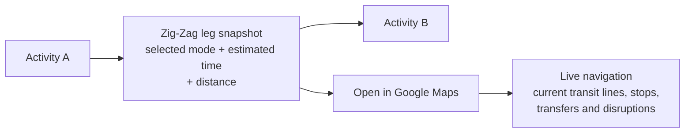

Zig-Zag remains responsible for deciding that the leg fits the schedule and
uses a mode allowed by the user. For `public_transport`, the UI may show
"public transport, approximately 35 minutes" and open Google Maps with origin,
destination, transit mode, and, when available, the intended departure time.
The MVP does not persist a bus/subway line, stop sequence, transfer instructions,
turn-by-turn directions, or a detailed polyline. Those details are volatile and
belong to the live navigation provider.

Travel time must come from deterministic routing when available, not from an
LLM. If the first release lacks reliable public-transit routing, show a clearly
approximate conservative range, reserve the upper bound in the schedule, and
delegate the live route to Google Maps. Navigation is delegated; itinerary
feasibility is not.

### Current implementation checkpoint and remaining gap

The wizard now submits one typed contract containing allowed transportation
modes, interests, desired experience formats, exploration style, a per-day
walking budget, maximum continuous walking leg, pace, accessibility, and
bounded additional preferences. The normalized contract is persisted and the
bitacora reports those values as captured. Deterministic post-processing does
not yet implement the target mobility architecture above.
[route-optimizer.util.ts](../../be/src/modules/tours/utils/route-optimizer.util.ts)
uses nearest-neighbor plus 2-opt over straight-line Haversine distance for every
request, and
[travel-time-calculator.util.ts](../../be/src/modules/tours/utils/travel-time-calculator.util.ts)
assumes walking at 5 km/h and stops calculating at a 2 km leg. It can reorder
selected stops but cannot reject, replace, cluster, or route them differently
for cycling, driving, or public transport. Treat this section as required
design input before extending candidate selection or route optimization;
consult the code for the current implementation state.

### Persisted draft versus user confirmation

Asynchronous generation requires a persisted Tour ID before activities can be
generated, so persistence itself is not user confirmation. The current schema
tracks generation progress but has no independent lifecycle state; the review
button only applies composite-waypoint edits and navigates to detail. A separate
increment must introduce a domain lifecycle such as `DRAFT | CONFIRMED |
ARCHIVED`, show review for every generated tour, expose an explicit confirm
operation, and keep drafts separate from confirmed saved tours. Future prompt
edits should operate on a draft revision rather than silently mutate a
confirmed historical snapshot.

## Places acquisition: Text Search primary, Nearby coverage secondary

This section is a **zoom into the Places acquisition node of the end-to-end
flow**. It does not introduce a mandatory crawl on every request. Its output
returns to `Persist and deduplicate real POIs`, followed by catalog re-query,
semantic/spatial analysis, and coverage evaluation.

Places acquisition has two independent needs: retrieve relevant visitor POIs
from an intent-driven Text Search and, only for an explicit remaining type/zone
gap, cover part of a city polygon with bounded point-based Nearby operations.
Google Places is the selected MVP provider; Geoapify remains an explicitly
selected adapter, not an automatic fallback. Provider capabilities remain
visible rather than being forced into equivalent-looking calls.

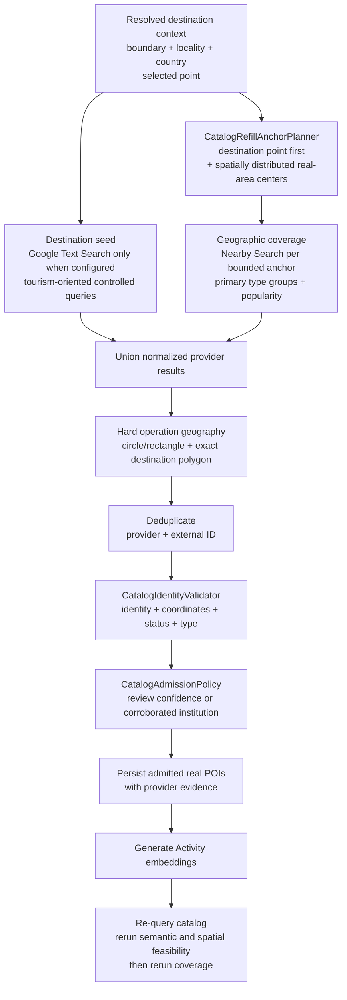

This Places zoom ends at catalog reevaluation. It does not enumerate OSM
neighborhoods or create a composite. A missing walk/route/experience becomes a
typed coverage deficit and enters the grounded-proposal resolver shown in
[OSM composite resolution](#osm-composite-resolution).

An anchor is an implementation point for calling a point-based API. It is not a
new domain entity and is not persisted as an Activity. Point-scale destinations
use their own point as the single anchor; area-scale destinations use a bounded
number to control latency, quotas, and cost.

For an area-scale destination, the selected destination point is the first
anchor when it lies inside the boundary. Remaining anchors are selected from
structurally valid real child-area centers by a named, deterministic spatial-
coverage algorithm. Four to eight total anchors is a target only when that many
authoritative points exist. The engine does not fabricate grid points or use
alphabetical/relevance ordering to reach a quota. An anchor means API coverage;
it never means that its neighborhood is touristic or selected for a composite.

### Provider-operation zoom inside catalog acquisition

The following diagram is a second-level zoom into the seed and geographic-
coverage operations. Text Search is an explicit acquisition operation, not a
fallback after Nearby failure.

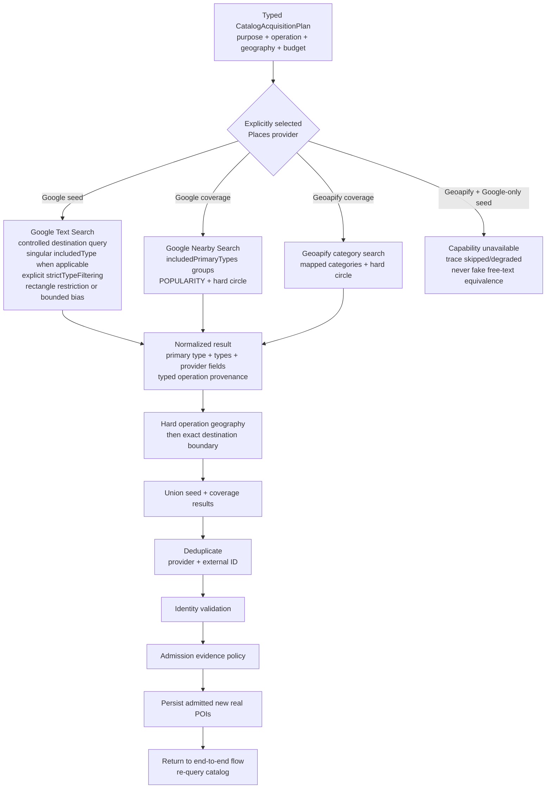

Operation semantics are deliberately not presented as equivalent:

- Google `searchNearby` is the geographic-coverage operation for conventional
  typed POIs. Catalog refill uses controlled `includedPrimaryTypes` groups and
  `POPULARITY`; its provider request enforces a circle.
- Google `searchText` provides the configured destination-level tourism seed.
  It uses structured locality/country context and a rectangular restriction
  where supported. Every result still receives the exact backend destination-
  polygon check.
- Google Nearby `includedPrimaryTypes` and Text Search's singular
  `includedType`/`strictTypeFiltering` are different contracts. The provider
  interface and trace preserve that difference. `strictTypeFiltering=false`
  does not mean that `includedType` is harmless: Google documents that
  categorical queries almost always apply the type filter. Broad visitor or
  mixed-theme queries therefore omit `includedType` and carry a separate
  explicit list of admissible returned primary types; a narrow one-type query
  may use it.
- Geoapify Places has no equivalent descriptive free-text Places endpoint. A
  Google-only destination seed is skipped visibly when Geoapify is selected;
  category mappings remain category operations, not fake Text Search.
- Exhausting or failing Nearby does not cause the same request to be retried
  through Text Search, and provider failure does not automatically switch
  Google to Geoapify. Independent configured operations may still produce a
  truthful partial result.
- Seed and coverage operations share one explicit total call/time/result
  budget. After reserved seed operations, the scheduler distributes grouped
  primary-type operations fairly across requested categories and anchors.
- If no valid candidate remains, any provider quota, rate-limit, strict-cache,
  or availability failure must remain visible; the engine must not rewrite it
  as "the destination has no places."

### Catalog candidate validation contract

The catalog write gate coordinates `CatalogIdentityValidator` and
`CatalogAdmissionPolicy`. Free-form LLM output never passes through this path
and cannot be persisted as a POI. Identity validation establishes that the
provider entity is structurally usable; admission requires enough evidence for
it to enter Zig-Zag's reusable catalog. Admission does not guarantee later tour
eligibility, which belongs to the read-side coverage quality gate (`CoverageAnalyzer`).

| Rule                        | Rejection reason                      | Exact meaning                                                                                                                                                                                                                                                                                                                                                                                   |
| --------------------------- | ------------------------------------- | ----------------------------------------------------------------------------------------------------------------------------------------------------------------------------------------------------------------------------------------------------------------------------------------------------------------------------------------------------------------------------------------------- |
| Non-empty normalized name   | `empty_name`                          | Unicode accents, case, punctuation, and repeated whitespace are normalized before checking.                                                                                                                                                                                                                                                                                                     |
| Non-generic identity        | `generic_name`                        | Exact placeholder-like names such as `Arquitectura`, `Edificio`, `Monumento`, `Point of Interest`, `Unnamed Road`, or `Sin nombre` are not useful catalog entities. A real specific name containing one of those words is not rejected by this rule.                                                                                                                                            |
| Provider identity           | `missing_provider_id`                 | A stable Google Place ID or Geoapify place ID is required so the same real entity can be deduplicated and traced.                                                                                                                                                                                                                                                                               |
| Valid coordinates           | `invalid_coordinates`                 | Latitude and longitude must be finite and inside the legal WGS84 ranges.                                                                                                                                                                                                                                                                                                                        |
| Operation geography         | `out_of_area`                         | Nearby results must be inside their hard anchor circle. Destination-seed Text results must satisfy their configured rectangle when used. Every area-scale result also receives the exact destination-polygon check. Provider bias alone is never trusted.                                                                                                                                       |
| Destination boundary        | `outside_destination_boundary`        | For an area-scale destination, the point must also be inside the authoritative Polygon or MultiPolygon, including hole handling. A high rating does not override this rule.                                                                                                                                                                                                                     |
| Operating status            | `permanently_closed`                  | Reject only provider statuses meaning that the business ceased operating permanently: Google `CLOSED_PERMANENTLY` or its normalized equivalent `PERMANENTLY_CLOSED`. This does **not** mean closed now, outside opening hours, a holiday, or a temporary closure. Schedule feasibility is a later tour-planning concern, not catalog identity validation.                                       |
| Supported semantic type     | `unsupported_type`                    | At least one provider type must map to a supported catalog POI type such as museum, landmark, place of worship, park, food venue, or entertainment venue.                                                                                                                                                                                                                                       |
| Supported primary type      | `unsupported_primary_type`            | Google admission requires the returned `primaryType` to match a controlled catalog mapping for the acquisition operation. A requested type or unrelated secondary type is not enough. Provider adapters without an equivalent primary type use their own explicit policy.                                                                                                                       |
| Internally consistent types | `conflicting_provider_types`          | A supported primary type is rejected when additional structured provider types contradict that identity under a narrow documented rule. Examples: `church`/`place_of_worship` combined with `school`/`educational_institution`, or generic `park` combined with `campground`/`lodging`, do not enter the corresponding visitor pool. This is type-based and does not use place-name blacklists. |
| Not an address feature      | `address_only`                        | Results whose types are only street address, route, premise, postal code, intersection, neighborhood, locality, administrative area, or country are not materialized as POIs. OSM streets and areas follow the composite-activity path instead.                                                                                                                                                 |
| Review-backed admission     | `insufficient_review_confidence`      | A Google candidate using the review-evidence path must pass the explicit category policy. A perfect rating backed by one review is not sufficient. Policy parameters are centralized, traced, and tested at their boundaries.                                                                                                                                                                   |
| Institutional admission     | `missing_institutional_corroboration` | A supported institutional primary type without sufficient review confidence requires structured corroboration such as an official website, phone, or opening hours. A `museum`/`church` type alone is not evidence.                                                                                                                                                                             |
| Provider-specific admission | `insufficient_provider_evidence`      | A provider without Google-equivalent review/primary-type data follows its own documented evidence contract. It must not inherit Google's fields or silently pass every mapped category.                                                                                                                                                                                                         |

Google review-confidence boundaries are centralized and inclusive:
visitor landmarks `4.0/50`, museums and arts `4.0/20`, outdoor `4.1/50`, food
and nightlife `4.2/100`, and entertainment `4.0/100` (rating/review count).
Missing ratings are not interpreted as zero; they must use an applicable
corroborated-institution or provider-specific evidence path instead. These are
write-admission boundaries, not tour-ranking weights.

Deduplication by `provider + external ID` happens after the operation-specific
circle/rectangle check and before identity validation. A duplicate contributes
`duplicate_result`; an already persisted valid entity contributes
`existing_activity`. Neither is a new catalog row. Operational conditions such
as `provider_request_failed` and `refill_budget_exhausted` describe acquisition
degradation, not bad places, and therefore remain separately visible.

The generation trace reports the stages with deliberately different counters:

- `seedReceived` / `coverageReceived`: raw results by acquisition purpose;
- `deduplicated`: repeated provider identities removed after the union;
- `identityValid`: unique candidates that passed structural identity rules;
- `admitted`: identity-valid candidates that passed an evidence path;
- `persisted`: admitted candidates that were actually new rows;
- `embedded`: newly persisted Activities whose embedding write succeeded;
- `rejectedCountByReason`: the reasons above, including operational reasons.

One candidate can have multiple identity/admission reasons, so the sum of the
per-reason counters may exceed the number of rejected candidates. A failed
embedding is reported truthfully and does not pretend that semantic ranking
was available. Legacy rows already present in a disposable local database are
not proof that the write gate failed: the admission write gate prevents new invalid persistence;
the later read-side eligibility gate handles pre-existing catalog data.

The development bitacora must render the non-request-failure entries from
`rejectedCountByReason` using their canonical codes; it must not tell a reader
to consult details that the UI and copied trace do not expose. Provider request
failures remain a separate operational count. Offered catalog candidates also
show their provider primary type and Zig-Zag catalog category when available,
so a real but unexpectedly ranked item can be audited without guessing from
its name. Destination resolution describes an authoritative city boundary as
the scope for retrieval/acquisition; it must not claim that neighborhoods were
explored unless a later targeted proposal-resolution stage actually did so.

### Exact OSM membership inside proposal resolution

Coverage-anchor centers are not polygons and cannot prove that a catalog POI
lies inside a neighborhood. Only after Discovery or an existing reusable family
names a finite real area may the proposal resolver use a bounded Overpass batch
to evaluate its candidate points against authoritative boundaries:

- no matching child area is `unresolved`, not evidence of zero quality;
- more than one matching child area is `ambiguous` and is not assigned;
- provider or contract failure is `unavailable` and cannot trigger an
  alphabetical or nearest-centroid fallback;
- one matching expected area provides membership evidence for that concrete
  proposal only; it does not rank the area against every barrio in the city.

The resolver hydrates the proposed area's real Polygon/MultiPolygon by OSM ID
and runs detailed calls only inside that finite scope. Google POIs can become
composite waypoints only through exact, unambiguous membership; coordinate
checks against lightweight OSM centers are forbidden. This adapter is delivered
with the proposal resolver, not earlier as unused infrastructure.

```text
Catalog Refill finds conventional real POIs through Google Places.
Activity Discovery proposes higher-level experiences missing from the catalog.
```

## Coverage decision

Coverage is not a single candidate count. It should report:

- usable quantity for requested days and pace;
- strong semantic matches for every requested interest;
- Activity kind diversity;
- transport-feasible candidate groups for each day;
- per-leg and per-day travel-time budgets for the allowed modes;
- destination distribution without forcing unrelated distant clusters into one day;
- quality/confidence;
- destination-knowledge state: profiled and fresh, stale, or unprofiled;
- missing themes and kinds to request from discovery.

For an already-profiled destination, Discovery receives only missing coverage.
For a new or stale destination it may produce one bounded profile/bootstrap
even when the raw catalog count is high; Santa Fe demonstrated that 51 Places
rows can still omit most obvious visitor landmarks. It must not rediscover an
entire healthy destination for every tour.

### Grounded destination bootstrap and qualitative-gap discovery

This stage belongs to the
provider-neutral Activity Discovery pipeline. It is not an always-first provider:
it runs for an unprofiled/stale destination or a concrete qualitative,
must-see, theme, neighborhood, or experience gap. A conventional named POI can
go directly to Places resolution without grounded discovery.

**Implementation:** discovery is two separate
providers, not one combined step. A `GroundedSearchProvider` gathers real
search evidence first (`GroqGroundedSearchService` — Groq's `browser_search`
tool — or the current default, `SerpApiGroundedSearchService`, a plain Google
Search API decoupled from the extraction model's own token/rate quota); only
if that step reports `groundingStatus: 'applied'` does a
`SearchGroundedDiscoveryProvider` (`GroqDiscoveryProvider`) run structured
extraction over the supplied evidence. The extraction step may never invent
evidence: `ActivityProposal.evidenceKeys` and each `EntityHint.evidenceKeys`
reference only keys the search step actually returned, checked at both
granularities before a proposal is accepted.

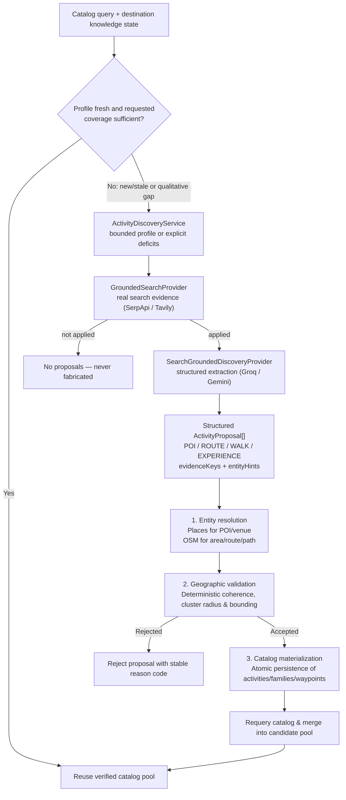

### Tripartite Proposal Pipeline

Discovered proposals transition across three strictly isolated stages:

1. **Entity Resolution (`ActivityProposalResolutionService`)**: Maps LLM-generated `entityHints` to real provider records (Places, OSM). This stage does not evaluate spatial coherence, kind rules, or persist records.
2. **Deterministic Geographic Validation (`CompositeGeographicValidationService`)**: Applies pure deterministic checks (bounding box, cluster radius, minimum component counts, route continuity) based on the proposal kind (`NEIGHBORHOOD_WALK`, `ROUTE`, `EXPERIENCE`).
3. **Catalog Materialization**: Only `GEO_VERIFIED` proposals are persisted to the database in an atomic transaction, generating canonical Activity IDs and triggering asynchronous media enrichment.

### Transactional Outbox and Asynchronous Media Architecture

- **Transactional Initiation:** `TourGenerationService.createTourFromWizard` creates the tour in `pending` state and atomically enqueues a `TourGenerationRequested` outbox event in the same database transaction. `TourGenerationProcessorService` consumes the event to execute generation.
- **Consumer Policy:** `InMemoryQueueService` enforces local subscriber registration for critical topics (`TourGenerationRequested`, `ActivityMediaEnrichmentRequested`). If no handler is registered, an error is thrown to keep the event retryable in the outbox loop. Optional topics (e.g. `ActivityMediaUpdated`) are acknowledged as no-ops.
- **Asynchronous Media Enrichment:** Media lookup (Wikimedia Commons / geosearch) runs purely in the background via `ActivityMediaEnrichmentRequested` and emits `ActivityMediaUpdated`. Media enrichment never blocks tour generation, planning feasibility, or tour completion.

The grounded provider may propose `San Telmo`, `La Boca`, or `Recoleta`, but
those strings have no geographic authority. `Montserrat` versus OSM
`Monserrat` requires an explicit alias/fuzzy-name resolution constrained to
the destination. A phrase such as `downtown area`, an out-of-city homonym, or
an invented neighborhood is rejected unless it resolves unambiguously to one
of the OSM boundaries already offered. Raw model text is trace evidence only;
it is never persisted as an `AREA`, geometry, external ID, or catalog prose.

## Activity proposal boundary

A provider-neutral proposal is not a persisted Activity. At minimum it carries:

```text
name
kind: POI | ROUTE | NEIGHBORHOOD_WALK | EXPERIENCE
themes[]
suggestedDurationMinutes
shortReason
entityHints[]     // each hint: key, name, role, expectedType, required, evidenceKeys[]
evidenceKeys[]    // keys into the search provider's evidence map
```

Entity hints use stable keys and controlled role/expected-type vocabularies.
AREA is resolution context rather than a recommendable proposal kind. POI
proposals are supported because grounded recommendation can identify missing
must-see entities; each still requires exact Places resolution before it can
be persisted.

Evidence is owned by the search provider, never the extraction step:
`evidenceKeys` at both the proposal level and the individual `entityHints[]`
level reference that provider-supplied map — a required hint with no
evidence, or one citing a key the search step never returned, rejects the
proposal. The extraction step may cite evidence; it may never invent a
snippet, source, or URL of its own.

The short reason and raw provider output belong in the generation trace for
auditability. They must not be copied directly into persisted catalog prose.

## Change checklist

Before merging a change to this engine, verify:

- Does catalog retrieval still run before discovery?
- Are point-scale and area-scale destinations explicit?
- Are geography and identity authoritative rather than semantic?
- Can every persisted coordinate, geometry, and external ID be traced?
- Is discovery provider-neutral and free of Prisma dependencies?
- Does CoverageAnalyzer request only missing coverage?
- Does coverage represent feasible per-day groups rather than a raw count?
- Are themes, desired experience formats, allowed transport modes, pace, daily
  walking distance, and continuous walking-leg limits represented separately?
- Are embeddings generated from the canonical semantic document?
- Are embedding provider/model/version consistent with the index?
- Does `transportationMode` drive deterministic travel-time analysis and route
  validation instead of existing only in the LLM prompt?
- Are walking limits enforced per day and per leg without being inferred from
  “walking” as an experience format or transport mode?
- Does every persisted/displayed transition identify its selected mode and a
  defensible time estimate?
- Are live transit lines and turn-by-turn navigation delegated to the map
  provider without delegating itinerary feasibility?
- Are semantic relevance, set selection, and route ordering separate stages?
- Can an infeasible itinerary reselect, split, or reduce stops instead of being
  persisted unchanged?
- Does the planner receive only verified Experience IDs?
- Are flat and composite hallucinations rejected server-side?
- Are historical waypoint snapshots preserved?
- Are lifecycle changes explicit and restrictive?
- Was every superseded selector, branch, mock, trace label, and dependency
  removed rather than left as an unused fallback?
- Is the generation bitacora updated for new decisions and fallbacks?

> ## ✅ Current content resumes here
>
> The sections below (`Experience Domain V2 — provider boundaries` onward)
> describe the live, current architecture.

## Experience Domain V2 — provider boundaries

The V2 migration makes `Experience` the only schedulable tourism unit and
keeps `GeoEntity` as the representation of physical reality. The provider
boundaries are intentionally explicit:

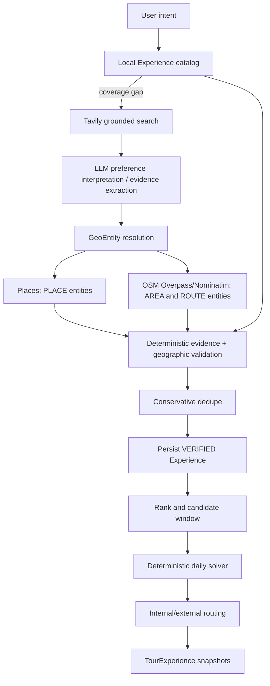

`ExperienceAcquisitionService` is the reusable acquisition boundary for
provider refills. Tour generation may invoke it after coverage analysis, but
the service does not create tours or snapshots; it only admits provider
results into the verified Experience catalog.

| Boundary | Authority and responsibility |
| --- | --- |
| Local nearby search | PostgreSQL/pgvector catalog retrieval; no external provider and no truth decision by itself |
| Google Places | Resolve a physical `GeoEntity PLACE` and its provider identity; a Nearby query is a resolver lookup, not Experience proof |
| OSM Overpass/Nominatim | Resolve `AREA`/`ROUTE`, boundaries and canonical geometry; route geometry is not generated by the planner |
| Tavily | Grounded evidence acquisition when local coverage is insufficient; never a geographic authority |
| LLM | Normalize free-text preferences and extract candidates/components from supplied evidence; never validates, deduplicates or plans |
| Geographic validation | Deterministic checks over evidence, resolved entities, destination scope and coherence |
| Daily planner | Deterministic scheduling of persisted VERIFIED Experiences only |

Routing is downstream of verification and selection. Provider-generated paths
are logistical derivations and must not be used as evidence that an Experience
exists. Outbox/queue execution remains asynchronous and durable. V2 media
enrichment uses `ExperienceMediaEnrichmentRequested` / `ExperienceMediaUpdated`
and updates the shared `Experience`; the legacy Activity media topic is not
part of the V2 generation path. The persisted Bitácora also contains an
`executionSummary` with the stage-by-stage decision narrative rendered by the
tour detail UI.
## Experience Domain V2 cutover (2026-09-02)

The current `feat/experience-domain-v2` implementation supersedes the historical Activity flow described in earlier sections of this document. The authoritative runtime path is:

```mermaid
flowchart LR
  W[Wizard intent] --> P[PreferenceInterpreter]
  P --> D[Destination boundary]
  D --> C[Verified Experience catalog]
  C --> A[Experience acquisition]
  A --> R[OSM/Places resolution]
  R --> V[Component geographic validation]
  V --> E[Evidence-backed Experience]
  E --> K[Experience ranking]
  K --> S[Deterministic daily planner]
  S --> T[TourExperience snapshots]
  T --> O[Outbox/media events]
  O --> B[Persisted Bitácora V3 + execution narrative]
```

`Activity`, `ActivityKind`, `TourActivity`, and the former format/kind coverage rules are historical terminology and are not part of the active V2 generation graph. V2 ranking is Experience-native and only applies deterministic relevance/capacity limits—there is no format or ActivityKind gate. Async generation remains durable: the HTTP request persists the Tour and outbox request first; the worker performs acquisition, resolution, validation, selection, planning, snapshot persistence, and media enrichment asynchronously. Grounded search and LLM extraction propose concepts and evidence only; OSM/Places resolution and component-level geographic validation decide whether an Experience is real.

### Current implementation checkpoints (2026-09-02)

- The active discovery boundary requires `extractExperiences`; the worker no
  longer falls back to the historical `ActivityProposal` extractor.
- The deterministic planner carries `experienceId` through selection,
  completeness, and `TourExperience` snapshot materialization. V2 generation
  does not look up planner items in `TourActivity`.
- Media notification delivery is Experience-native (`ExperienceMediaUpdated`)
  and resolves related tours through `TourExperience`.
- The local runtime is configured with Tavily for grounded search, Gemini for
  candidate extraction, Groq for the general chat provider, and the local
  Overpass instance for OSM queries.

These checkpoints are implementation evidence, not a declaration that every
historical test and document has been rewritten. The versioned migration
`20260902120000_remove_activity_domain_v2` drops the historical Activity tables
and enums idempotently after the prior migrations. It has been applied to the
local development database without deleting valid Experience or
TourExperience rows. New environments, including AWS, must run the complete
migration chain to receive the same cutover deterministically. The backend
typecheck is green; remaining frontend/type-test failures are tracked as
separate migration work rather than hidden behind compatibility aliases.

### Destination Cover Photo Asynchronous Resolution (2026-09-10)

- **Authentic Resolution via Outbox**: A Tour's presentation asset (`coverImage`) is resolved asynchronously during/after Destination Resolution via verified providers (`WikimediaPhotoProvider` / Google Places), avoiding expensive AI image generation stalls and preventing mismatched city fallbacks (e.g. Obelisco on Salta/Bariloche tours).
- **Direct SSE Delivery**: `TourProgressUpdated` carries the resolved `coverImage` directly in its payload over the SSE stream, allowing the client to transition without an extra HTTP round-trip, while simultaneously persisting `coverImage` to Postgres.
- **Frontend Skeleton Shimmer Contract**: While the tour is generating and `coverImage` is pending, `TourHeader` presents an animated skeleton shimmer (`TourHeaderSkeleton`). Upon SSE receipt, it performs a smooth fade-in to the verified destination photo. Hardcoded single-city placeholders are strictly prohibited across general fallbacks.
- **Full Spec**: See `docs/superpowers/specs/2026-09-10-destination-cover-photo-async-resolution.md`.


## Experience Domain V2 — component resolution and geographic validation amendment (2026-09-22)

The RW1 forensic rerun of 2026-09-22 supersedes the earlier all-or-nothing
`required` interpretation for composite components.

Current target flow:

```text
Experience/source evidence
        ↓
extract every evidenced component
        ↓
for each component:
  acquire/correlate candidates
  → identity decision
  → component geographic relation
        ↓
resolution coverage + research deficits
        ↓
Composite Geographic Validation
        ↓
verified canonical Experience
        ↓
traveler-facing enrichment
        ↓
ranking / deterministic planner
```

The extraction LLM does not own a `required` geographic-truth bit. A component
that cannot yet be resolved remains an explicit research deficit rather than
automatically erasing an otherwise source-backed composite.

Component geography and composite geography are separate:

- for a real AREA, point membership is based on the Polygon/MultiPolygon;
  outside points may have a measured near-boundary relation, which is not
  standalone acceptance;
- for a ROUTE, use real LineString/intersection/corridor semantics rather than
  one representative point;
- POINT_RADIUS continues to use center/radius semantics;
- composite validation decides whether the resulting INSIDE/INTERSECTS/NEAR
  relations form one coherent evidence-backed Experience.

For example, an evidenced San Telmo walk can legitimately start at Plaza de
Mayo outside the neighborhood polygon and enter San Telmo via Calle Defensa.
Strict containment of every stop would reject a real route. Conversely, mere
proximity to San Telmo does not make an unrelated place part of the walk.

Identity corroboration is additive. OSM/Nominatim/Places observations may
converge on one canonical object; this must be traced, but provider counts are
not votes. A missing/non-matching Wikidata corroboration is not by itself
positive evidence that the candidate is wrong.

The hard physical kinds remain `PLACE | AREA | ROUTE`; this amendment does not
introduce a second closed tourism semantic-type taxonomy for identity.

Full rationale and open decisions:
`docs/superpowers/specs/2026-09-22-component-resolution-geographic-validation-and-enrichment-amendment.md`.

## Experience Domain V2 — catalog-first identity reuse and semantic ranking refinement (2026-09-22)

The component-resolution amendment is refined by one additional boundary:
**Zig-Zag's canonical catalog is the first identity-memory lookup for a
component, not merely the final write destination.**

Target V2 flow:

```text
source-backed Experience evidence
        ↓
component hints
        ↓
canonical GeoEntity lookup
        ↓
reuse sufficient known identity
OR
open precise external resolution deficit
        ↓
correlate provider observations + canonical knowledge
        ↓
component identity + geographic relation
        ↓
composite geographic validation
        ↓
persist/reuse canonical Experience
        ↓
Experience semantic embedding / versioned index
        ↓
preference composition + cosine similarity
        ↓
deterministic planner
        ↓
planner residual-capacity backfill
  catalog/reservoir first
  external acquisition only if still insufficient
```

### Catalog-first does not mean cache-trust

A catalog candidate is reusable only when the canonical identity facts are
sufficient, structurally compatible and not positively contradicted in the
current context. Otherwise the resolver researches the missing fact through
the applicable providers and reconciles the new observations with existing
knowledge.

External providers are therefore **deficit repair**, not mandatory
reconfirmation of every already-known physical entity on every request.

### Component resolution does not create standalone Experiences

`ExperienceComponent` continues to reference `GeoEntity`.

A component verified while resolving a composite may create/reuse that
GeoEntity, but it does not create a standalone Experience as a side effect.
Standalone Experiences require their own source-backed acquisition/discovery
authority. The same GeoEntity can later be shared by the composite and any
independently discovered standalone Experience.

### Nearby/planner boundary

Geographic proximity never proves composite membership. Planner backfill may
schedule independent verified Experiences to use residual daily capacity, but
it must not rewrite the canonical component set of a source-backed Experience.

Catalog/ranked-reservoir reuse comes before external acquisition. Any acquired
Experience must pass the normal evidence → resolution → validation →
persistence path before replanning.

### Embedding boundary

Embeddings are generated for canonical Experiences and compared with the
positive `PreferenceSpec.semanticQuery` through pgvector cosine similarity.
They affect deterministic composition/reservoir order and planner soft
relevance only after canonical eligibility.

They never establish GeoEntity identity, Experience existence, component
membership, geographic validity or facet coverage.

Removing LLM-owned component `required` changes the canonical semantic
document because the current document serializes `required/optional`.
The cutover therefore requires an embedding document-version bump and reindex
of stale VERIFIED Experiences.

### Experience Domain V2 — catalog-first ownership refinement (2026-09-23)

Catalog-first component reuse is a read-side resolution boundary, not a new
identity authority:

```text
ExperienceProposalResolverService
→ ExperienceCatalogService.findGeoEntityCandidatesForHint(...)
→ candidate correlation
→ IdentityVerifier
```

The catalog service retrieves canonical candidates; correlation groups
observations that share exact/canonical identity facts; `IdentityVerifier`
alone decides whether a candidate/cluster satisfies the component hint.

The schema already has typed `GeoEntity.kind: GeoEntityKind`
(`PLACE | AREA | ROUTE`), first-class name/address/geography, and
`GeoEntityIdentity(provider, externalId)`. Do not add a duplicate kind field or
migration. Existing `upsertGeoEntity` nearby reconciliation is write-time
dedupe after provider resolution; catalog-first is read-time knowledge reuse
before provider calls. A dedicated alias model remains optional until
characterization proves it necessary.
### Experience Domain V2 — source grounding and deficit classification refinement (2026-09-22)

Catalog-first reuse does not weaken source authority. Before any component hint
can enter identity resolution, its cited SourceObservation must contain
verifiable support for the component (a structured source item or a bounded
textual support span that can be checked against the captured evidence). A
nearby real GeoEntity cannot retroactively justify an extractor hallucination.

The RW1 cold-2 `Basílica de Santa Mónica` / `ev-11` case is the regression
fixture: the component must fail at source-support admission, not later only
because no provider happened to return a matching POI.

Candidate correlation is a distinct provider-neutral stage before final
IdentityVerifier judgment:

```text
catalog candidate + provider observations
        ↓
deterministic canonical-object correlation
        ↓
candidate cluster(s) + typed evidence
        ↓
IdentityVerifier
```

Correlation owns grouping only. IdentityVerifier remains the single authority
for "does this candidate/cluster satisfy the hint?". Provider count is never a
vote.

Finally, only genuine world-knowledge ambiguity may become a Tourism Researcher
deficit. Provider/operational failure, premature acquisition termination,
source-contract violation or a misleading aggregate rejection reason are
system defects and stay outside the research-agent loop.


## Experience Domain V2 — exhaustive source-atom labelling amendment (2026-10-06)

**Status: PROPOSED target contract. Spike only; not implemented in the
production extractor.** The production path still asks the extractor to
generate `ExperienceCandidate`s from prose. This amendment defines the
replacement contract for editorial itinerary units (`SECTION_UNIT`,
`sectionComplete=true`) and the evidence a later cutover must meet. Spike:
`spikes/rw4-atom-labelling-2026-10-06/`. Finding:
RW4-EXTRACT-COMPLETENESS-1 (`spikes/rw4-extract-completeness-2026-10-05/`).

### Problem

```text
complete editorial unit → LLM generates candidate(s) → validators check what was emitted
```

The mechanical loss paths are fixed: unit windowing, early acceptance of an
incomplete window, silent `MAX_HINTS` truncation, markdown span
normalization, and a prompt without exhaustive itinerary semantics. The
remaining defect is the contract itself. A generative extractor that gets a
complete unit can still omit a required stop, merge segments that the
source separates by a transfer, or promote a passing mention. Source
support, identity, geography and `INCOMPLETE_SOURCE_COMPOSITION` judge only
emitted objects. A missing stop leaves nothing to judge. Model selection
lowers the omission rate but does not make an omission detectable.

### Target contract

```text
editorial unit
  → deterministic atomization        (no semantics)
  → LLM labels EVERY atom            (semantic authority)
  → deterministic completeness check (fail closed)
  → deterministic assembly           (order, segments, roles)
  → source support → identity → geography   (unchanged)
```

The LLM stays the only semantic authority. Deterministic code splits text and
checks structure. It never infers itinerary meaning from words. Keyword
lists, transport dictionaries and `Stop N` shortcuts are forbidden as
classification rules.

#### 1. Source atom

A source atom is a deterministic text unit with a stable identity and a
source position:

- `atomId`: the ordinal in source order, zero-padded (`a-001`). It is
  stable for identical input.
- `sourceStart`, `sourceEnd`: offsets into the editorial unit.
- `text`: the exact source slice.
- Provenance: `blockKind` (`HEADING | LIST_ITEM | TABLE_CELL | LINE`) and
  `fragment` (only for a bounded split of an over-long piece).

Boundaries come only from neutral text structure: line breaks, unescaped
table pipes, and sentence-final punctuation followed by whitespace. A
terminator right after a token of at most three letters or digits is not a
boundary. This abbreviation guard works by token length, never by a word
list. Merging is always safe: it makes atoms coarser and never drops text.
A piece longer than the atom bound is split at whitespace into fragments
that keep their offsets.

Atoms and separators partition the unit exactly. A separator is whitespace,
a newline, a table pipe, or a piece with no letter or number once URL
targets are elided (pure markup, or an image whose only content is its
URL). Such a piece cannot name a place, so dropping it from labelling loses
nothing semantic. Its range is still recorded. No text disappears because
of a token budget: a unit too large for one request is batched (below).

The model sees each atom with markdown link and image targets and bare URLs
replaced by `…`. Every presented character maps back to a source offset.

#### 2. Semantic classification

Every atom receives exactly one classification:

| Classification | Meaning | Membership effect |
|---|---|---|
| `ITINERARY_STOP` | directs the traveller to a named place in the itinerary (start, visit, stop, enter, arrive, numbered stop) | mandatory |
| `OPTIONAL_STOP` | a named place presented as optional or extra | optional, never mandatory |
| `ALTERNATIVE` | a choice among places, or a recommendation among options (for example where to eat) | a choice group, never flattened |
| `TRANSFER` | describes or announces a motorized or public-transport move to the next part of the itinerary | segment boundary |
| `PASS_BY` | named places only seen or passed (streets walked, buildings seen, orientation) | context, never membership |
| `NON_ITINERARY` | description, history, tips, captions, ads, navigation, author notes | none |

Walking between places is never a `TRANSFER`. `transferMode`
(`BUS | TAXI | METRO | TRAIN | TRAM | FERRY | CAR | OTHER_MOTORIZED |
UNSPECIFIED`) is optional semantic metadata on a `TRANSFER` atom.

#### 3. Zero-to-many entities per atom

An atom is not a stop. One atom may name zero, one or several places, each
with its own role:

```json
{
  "atomId": "a-012",
  "classification": "ITINERARY_STOP",
  "entities": [
    { "sourceName": "the old lighthouse", "supportSpan": "climb the old lighthouse", "role": "ITINERARY_STOP" },
    { "sourceName": "Harbour Road", "supportSpan": "walking along Harbour Road", "role": "PASS_BY" }
  ],
  "reason": "audit only"
}
```

- `sourceName` is the exact source wording. No translation, expansion or
  canonical naming happens here. Identity stays with the geographic
  resolver. `MISSING_NORMALIZATION_KIND` and the identity gates are
  unchanged; this contract simply never asks for normalization.
- `supportSpan` must be inside that atom. Containment ignores only case,
  accents, emphasis/escape/quote characters and whitespace runs. The span
  is mapped back to source offsets.
- `sourceName` must be inside its `supportSpan`. A name that is not in the
  atom is an invented entity and makes the response invalid.
- Role consistency: a `NON_ITINERARY` atom has no entities. Any other
  non-`TRANSFER` atom has at least one entity, and its classification
  equals its strongest entity role
  (`ITINERARY_STOP > OPTIONAL_STOP > ALTERNATIVE > PASS_BY`). A `TRANSFER`
  atom may name its destination, as `ITINERARY_STOP` when visited next and
  otherwise as `PASS_BY`.
- `reason` is audit only and never authority. No canonical entity IDs, and
  no model-authored ordinals.

#### 4. Exhaustiveness invariant

Every input atom appears exactly once in the semantic result. The result is
invalid, and extraction FAILS CLOSED for that unit, when any atom is
missing or duplicated, any label names an unknown atom (including a
read-only context atom), any label or entity is malformed, a span is
outside its atom, a name is outside its span, or roles are inconsistent.
There is no partial acceptance and no fallback to the generative candidate
contract.

When the atoms do not fit one request, they are batched under their global
IDs. Each atom belongs to exactly one batch. Preceding atoms may be shown
as read-only context. A batched result is valid only if each batch is valid
for its own scope and the union labels every unit atom exactly once.

#### 5. Deterministic assembly

The backend derives every fact that needs no further interpretation:

- **Order:** atom order, then span position inside the atom. Never a
  model-generated ordinal.
- **Segments:** a `TRANSFER` atom closes the current segment once that
  segment has membership from a non-`TRANSFER` atom. Adjacent `TRANSFER`
  atoms, such as a heading and the sentence that follows it, form one
  boundary. A transfer destination labelled `ITINERARY_STOP` opens the new
  segment. The model is never asked to remember to emit a separate
  candidate per segment.
- **Membership:** only `ITINERARY_STOP` entities are mandatory.
  `OPTIONAL_STOP` stays optional. `ALTERNATIVE` entities form choice
  groups: consecutive alternative-bearing atoms (atoms with no entities do
  not interrupt). `A or B` never becomes `A + B`. `PASS_BY` keeps
  provenance only. `NON_ITINERARY` contributes nothing.
- An exact repeat of a folded name inside one segment is one member with
  all of its provenance. A mandatory occurrence absorbs weaker ones. This
  is string equality, not identity.

Each segment with mandatory membership is a source-defined composition
candidate. Its members carry `sourceName`, `supportSpan` and source offsets
into the existing source-support → identity → geography →
`INCOMPLETE_SOURCE_COMPOSITION` path, which is unchanged.

#### 6. Failure policy

Incomplete or structurally inconsistent labelling FAILS CLOSED for that
unit and records the issue list (atom IDs and codes). Never fall back to
accepting a generative candidate, never repair labels by guessing, and
never relax a downstream gate to compensate. A provider or transport
failure is an operational failure, not a semantic one.

### What this changes and what it does not

- An omission becomes observable. "Atom `a-079` is labelled `PASS_BY`"
  is an explicit, reviewable decision. A silently dropped stop is not.
- Segment loss and segment mixing caused by the model forgetting to emit
  a candidate become structurally impossible. Mixing remains possible only
  as a visible labelling decision (for example a transfer heading labelled
  as a stop).
- Semantic labels are still probabilistic. Exhaustiveness does not prove
  that `ITINERARY_STOP` vs `PASS_BY` is right. It makes every such call
  explicit and auditable.

Productization requires the spike's evidence and a separate owner
authorization. The production extractor path stays unchanged until then.
