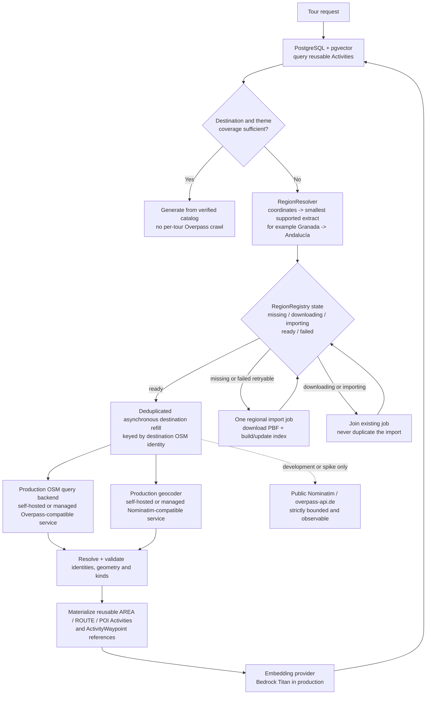
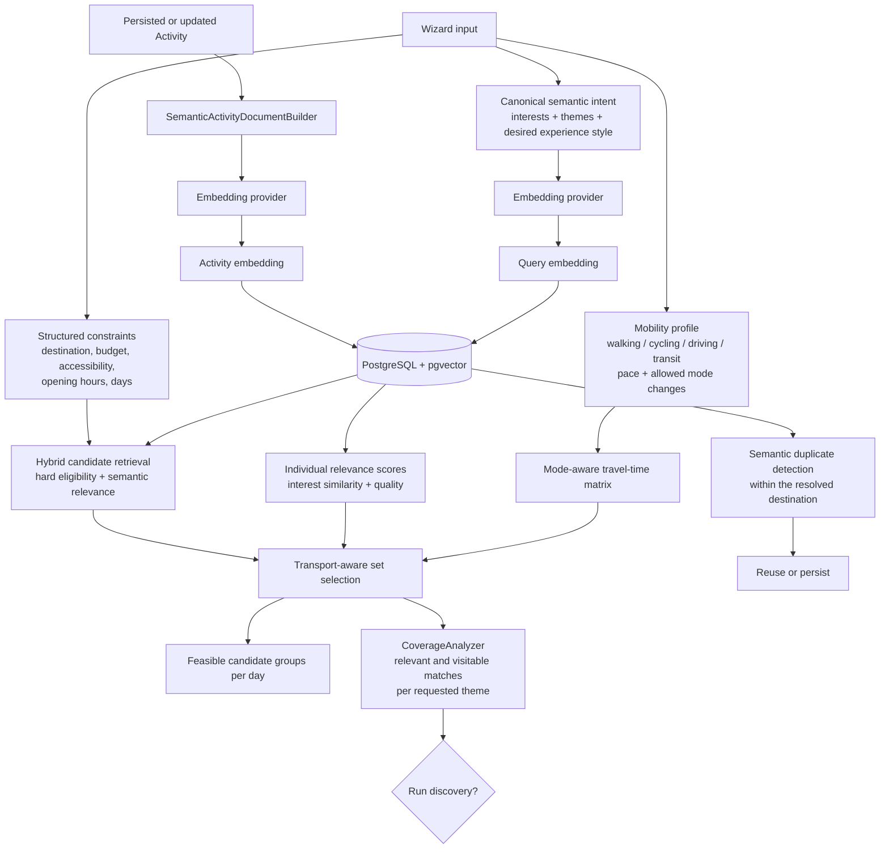
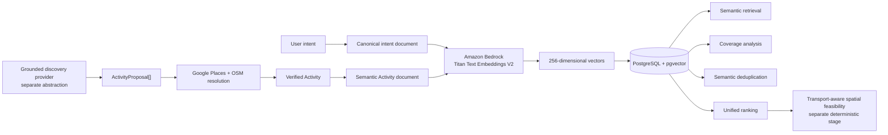
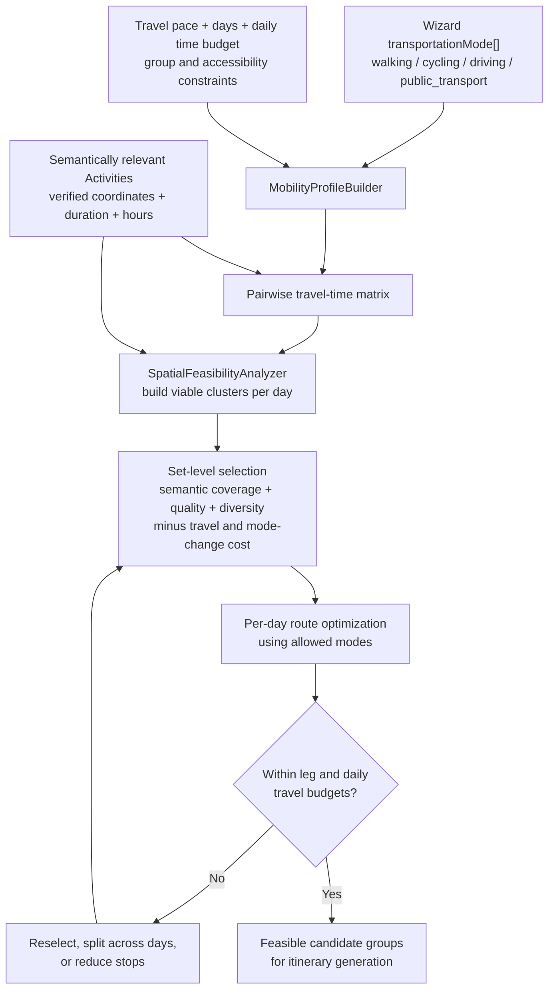
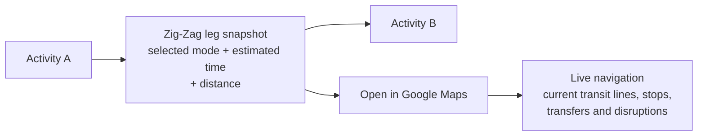
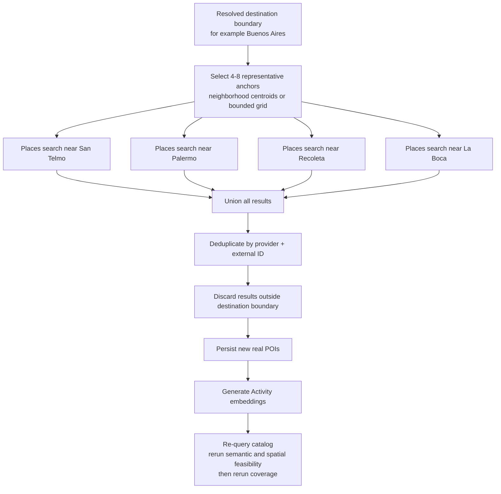
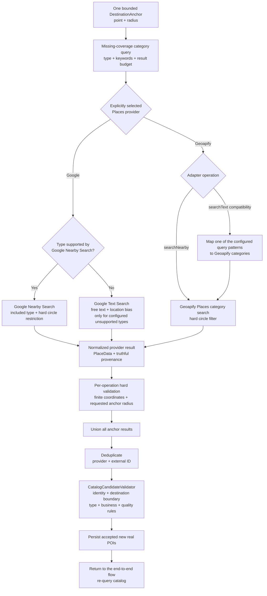
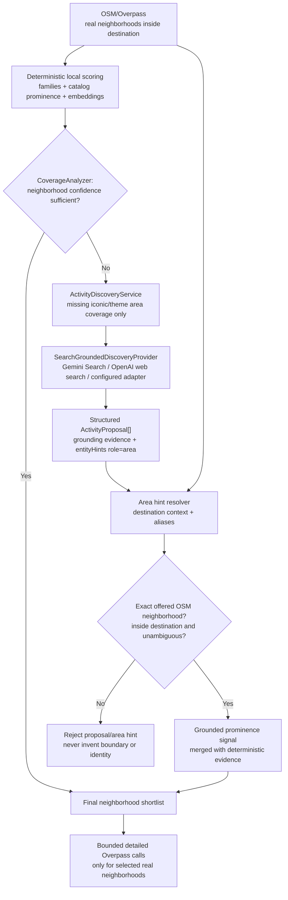

# Activity Discovery and Tour Generation

> **Status:** Target architecture and design invariants. Some stages already
> exist and others are planned. The current repository remains the source of
> truth for implementation status.
>
> **Mandatory reading:** Read this document before changing tour generation,
> activity retrieval/ranking, embeddings, destination resolution, composite
> Activities, Google Places/OSM integrations, or Activity Discovery.

This document describes how Zig-Zag should transform user preferences into a
grounded tour while growing a reusable catalog of neighborhood walks, food and
architecture walks, and route-based experiences.

Related documents:

- [Destination-aware activity engine design](../superpowers/specs/2026-08-21-activity-engine-design.md)
- [Destination-resolution implementation plan](../superpowers/plans/2026-08-21-activity-engine-destination-resolution.md)
- [Candidate quality, discovery, and mobility implementation plan](../superpowers/plans/2026-08-21-activity-engine-quality-discovery-mobility.md)
- [Generation bitacora design](../superpowers/specs/2026-08-20-generation-bitacora-design.md)

## Architectural invariants

1. Query the existing catalog before running Activity Discovery.
2. Keep Destination Resolution and Activity Discovery separate.
3. Discovery proposes semantic ideas; it never supplies trusted coordinates,
   Google Place IDs, OSM IDs, or geometry.
4. Google Places and OSM supply authoritative identity and geometry.
5. Persist only fully resolved and validated Activities.
6. The itinerary LLM may select only real Activity IDs offered by the backend.
7. Embedding similarity is a relevance signal, not proof of identity or truth.
8. Semantic relevance and spatial feasibility are separate decisions. A set of
   strong semantic matches is not sufficient unless it forms a viable tour.
9. The user's allowed transportation modes must drive deterministic travel-time
   analysis, spatial grouping, per-day routing, and feasibility validation. A
   prompt instruction is not enforcement.
10. Coverage means enough relevant Activities that can form feasible per-day
    groups for the requested transport, pace, and duration; it is not a raw
    candidate count.
11. For the first transport release, Zig-Zag owns leg feasibility, the selected
    mode, and a conservative time/distance estimate. Google Maps owns live
    transit lines, transfers, and turn-by-turn navigation.
12. Composite Activities are reusable catalog Activities grouped into stable
   families and variants. Waypoint content is not variant identity.
13. TourActivityWaypoint stores the effective ordered waypoint set used by a
   tour so later variant edits do not rewrite that set.
14. OSM streets and paths must never be materialized as kind=POI.
15. ActivityWaypoint continues to reference reusable Activity rows. Do not add
    a GeoFeature table without a demonstrated requirement.
16. Waypoint lifecycle changes are explicit: merge, replace/remove, or archive
    rather than silently corrupting a composite.
17. Provider/index availability and LLM reasoning are not verification. The
    generation bitacora may claim a semantic, transport, opening-hours, or
    feasibility signal was applied only when the corresponding deterministic
    stage records evidence that it actually ran successfully.
18. Background itinerary generation uses a compact selection contract. The
    LLM returns offered IDs plus scheduling intent, not duplicated names,
    coordinates, distances, travel times, or tour totals. After ID
    verification, the backend rehydrates canonical identity and geometry from
    the exact offered catalog candidates. A provider's failed or truncated
    draft is never salvaged as a verified itinerary.

## End-to-end flow

```mermaid
flowchart TD
    A["Tour Wizard<br/>destination, dates, interests,<br/>pace, group, transport, budget"]
    A --> B["UserIntentBuilder<br/>normalize preferences"]
    B --> MOB["MobilityProfileBuilder<br/>allowed modes + pace + days<br/>travel constraints"]

    B --> C["DestinationResolutionService<br/>Nominatim forward/reverse geocoding"]
    C --> C1{"Real bounded destination?"}
    C1 -- "Yes: city/neighborhood" --> C2["OSM boundary lookup<br/>Overpass query backend"]
    C2 --> C2A["AREA DestinationContext<br/>OSM boundary + bbox + centroid<br/>locality/country"]
    C1 -- "No: hotel/POI/address" --> C3["POINT DestinationContext<br/>lat/lng + radius"]
    C1 -- "External failure" --> C3

    C2A --> D["ExistingActivityRetriever"]
    C3 --> D
    D --> E["PostgreSQL catalog query<br/>POI + ROUTE + NEIGHBORHOOD_WALK + EXPERIENCE<br/>exclude AREA and archived"]

    E --> F{"Pool too small?"}
    F -- Yes --> G["Catalog Refill<br/>selected provider: Google Places or Geoapify<br/>see Catalog Refill zoom below"]
    G --> H["Persist and deduplicate real POIs"]
    H --> I["Re-query catalog"]
    F -- No --> I

    I --> SEM["Semantic retrieval and individual ranking<br/>Bedrock Titan in production / Ollama locally<br/>PostgreSQL pgvector"]
    SEM --> SF["SpatialFeasibilityAnalyzer<br/>mode-aware travel-time matrix<br/>cluster viable candidates by day"]
    MOB --> SF
    SF --> J["CoverageAnalyzer<br/>quantity + themes + kinds<br/>+ feasible per-day groups"]
    J --> J1{"Coverage sufficient?"}
    J1 -- Yes --> R["Set-level selection and unified ranking<br/>relevance + diversity + travel cost"]

    J1 -- No --> K["DiscoveryRequest<br/>only missing quantities/themes/kinds"]
    K --> L["ActivityDiscoveryService"]
    L --> M["SearchGroundedDiscoveryProvider<br/>planned: Gemini Search / OpenAI web search<br/>or another explicit adapter"]
    M --> N["ActivityProposal[] + evidence<br/>no invented coordinates or IDs"]

    N --> O["Schema validation<br/>kind, themes, hints, duration"]
    O --> P["ActivityProposalResolutionService"]
    P --> P1["POI / venue / museum / restaurant<br/>Google Places"]
    P --> P2["Street / path / route / neighborhood<br/>Nominatim + Overpass query backend"]
    P1 --> Q["ResolvedActivityProposal"]
    P2 --> WIKI["Optional OSM narrative context<br/>Wikidata/Wikipedia API when QID exists"]
    WIKI --> SAFE["Content-safety classification<br/>configured LLM; Groq in current local setup"]
    SAFE --> Q

    Q --> V["ActivityValidator<br/>identity, type, geography,<br/>coherence, distance, duration,<br/>waypoints and transport"]
    V --> V1{"Valid proposal?"}
    V1 -- No --> X["Discard<br/>record reason in generation trace"]
    V1 -- Yes --> W["CompositeActivityService<br/>reuse or persist<br/>AREA -> Family -> Variant -> Waypoints"]
    W --> REFRESH["Refresh semantic and spatial analysis<br/>for the expanded verified pool"]
    REFRESH --> R
    X --> R

    R --> S["Feasible candidate groups per day<br/>appropriate for allowed transport"]
    S --> T["Candidate window<br/>real IDs and feasible groups only"]
    T --> U["Itinerary LLM adapter<br/>Groq in current local setup<br/>compact selection: IDs + schedule only<br/>never create entities"]
    U --> Y["Anti-hallucination verification<br/>offered IDs, duplicates,<br/>waypoints and subsets"]
    Y --> Z{"Valid picks remain?"}
    Z -- No --> ERR["Explicit failure<br/>never invent Activities"]
    Z -- Yes --> CANON["Canonical hydration from catalog<br/>name + type + coordinates<br/>ignore generated identity/geometry"]
    CANON --> AA["Per-day route and schedule optimization<br/>mode-specific travel times<br/>opening hours + activity duration"]
    AA --> FEAS{"Schedule and mobility feasible?"}
    FEAS -- No --> RESELECT["Reselect or reduce stops<br/>never force an incoherent tour"]
    RESELECT --> R
    FEAS -- Yes --> LEG["Tour leg snapshot<br/>mode + estimated time + distance<br/>Google Maps handoff"]
    LEG --> AB["Persist generated tour"]
    AB --> AB1["TourActivity per selected Activity"]
    AB1 --> AB2["TourActivityWaypoint<br/>effective ordered snapshot"]
    AB2 --> AC["Generated tour + bitacora<br/>resolution, coverage, discovery,<br/>ranking and verification"]
```



Provider labels in this diagram are explicit calls, not automatic fallback
chains. If Google is selected for Places, a failure does not invoke Geoapify.
If Bedrock is selected for embeddings, a failure does not invoke Ollama or
OpenAI. The configured LLM provider may change behind its adapter; the trace
must record which provider actually handled the operation.

### Provider-call zoom: current OSM composite path

This is a zoom into destination resolution and composite candidate gathering
in the end-to-end flow. It describes the implemented backend path after PR 2;
Activity Discovery and deterministic mobility remain later stages.

```mermaid
flowchart TD
    INPUT["Wizard destination label + selected coordinates"]
    INPUT --> NF["Nominatim forward search<br/>original provider label"]
    NF --> MATCH{"Usable city/town/village<br/>near selected coordinates?"}
    MATCH -- "No: empty, ambiguous, or only far-away same-name results" --> NR["Nominatim reverse geocoding<br/>selected coordinates, settlement zoom"]
    NR --> NS["Nominatim normalized search<br/>structured locality + country"]
    MATCH -- Yes --> OB
    NS --> OB["Overpass query backend<br/>authoritative boundary by OSM ID"]

    OB --> ADMIN["Overpass query backend<br/>admin boundaries inside city<br/>map_to_area + city admin_level + 1"]
    PG[("PostgreSQL + pgvector catalog")] --> REPAIR["Bounded legacy-vector repair<br/>retrieved candidates with embedding IS NULL"]
    REPAIR --> SCORE["Local neighborhood shortlist<br/>reusable ActivityFamily + POI coverage<br/>rating/review prominence + wizard similarity<br/>deterministic no-evidence tie-break"]
    ADMIN --> SCORE
    SCORE --> DETAIL["Only shortlisted neighborhoods<br/>bounded street + POI detail queries<br/>Overpass query backend"]

    DETAIL --> OSMQ["OSM candidate quality gate<br/>real name; reject placeholders<br/>such as Sin Nombre / Unnamed Road"]
    OSMQ --> QID{"OSM candidate has<br/>tags.wikidata QID?"}
    QID -- No --> OFFER["Candidate remains eligible<br/>without narrative"]
    QID -- Yes --> WD["Wikidata/Wikipedia API<br/>batched entity summaries"]
    WD --> SAFETY["Configured completion provider<br/>Groq in current local setup<br/>content-safety batch + bounded 429 retry"]
    SAFETY -- safe --> OFFER
    SAFETY -- "unsafe or provider failure" --> OFFER

    REPAIR --> WINDOW["Verified catalog POIs"]
    OFFER --> WINDOW["Verified OSM composite candidates"]
    WINDOW --> LLM["Itinerary LLM adapter<br/>Groq in current local setup<br/>compact IDs + schedule schema<br/>bounded output; one provider-delay retry on 429"]
    LLM --> VERIFY["Anti-hallucination verification<br/>offered IDs + exact neighborhood scope<br/>dedupe IDs and normalized street names"]
    VERIFY --> HYDRATE["Canonical hydration of flat picks<br/>catalog name + type + coordinates"]
    VERIFY --> PERSIST["CompositeActivityService<br/>Activity + ActivityWaypoint"]
    PERSIST --> BACKFILL["Embedding provider<br/>index new composite or backfill reused variant"]
    HYDRATE --> MERGE["Merge verified flat + composite picks<br/>spatial ordering uses real coordinates"]
    BACKFILL --> MERGE
    MERGE --> SNAPSHOT["TourActivityWaypoint snapshot<br/>effective waypoints for this tour"]
```



The JSON-mode activity-generation contract is intentionally smaller than the
full schema used while initially creating the Tour shell. It requires only
`reasoning`, `activities`, and `compositeActivities`; each flat pick carries an
offered `activityId`, day/time/duration, a bounded short note, and an optional
verified waypoint subset. Server-owned values are populated only after the
anti-hallucination check. This prevents long multi-day responses from spending
Groq's completion budget repeating candidate data and then truncating before
the JSON object closes. A `json_validate_failed` draft does not enter the
repair, verification, or persistence path. If a later explicit retry succeeds,
its non-failed status removes the previous attempt's `generationError` and
`generationFailedAt`; stale failure metadata must not survive a completed run.

The implemented shortlist does **not** claim to know global tourism popularity.
It selects at most six real OSM neighborhoods using only evidence already
available for this request: a reusable family bonus, validated POI coverage,
rating/review-backed POI prominence, and the strongest indexed POI similarities
to the wizard interests. Detailed Overpass calls happen only after this
shortlist. Alphabetical OSM name/ID ordering is only the final stable tie-break
when neighborhoods have equal evidence; it is not treated as relevance.
Street-name placeholders are not evidence for a reusable experience and are
removed before prompting or persistence. This structural filter does not claim
that the remaining named streets are touristically meaningful; that semantic
gap belongs to grounded Activity Discovery and proposal resolution.

Wikidata does not enrich every Google/Geoapify POI. In the current path it
adds optional narrative grounding only to OSM candidates used while proposing
a composite. A safe extract may be stored as a composite `narrativeSource`; it
does not overwrite catalog POI prose. Missing QID, failed enrichment, or a
failed safety check removes only the optional narrative, not the candidate.

### Production topology: cold-destination OSM refill

The public Nominatim and Overpass community endpoints are not a mass-production
capacity layer. Retry, concurrency, and circuit-breaker logic protect the
application and those services, but cannot provide an SLA. At production
volume, normal tour requests should primarily reuse resolved OSM-backed
Activities from Zig-Zag's catalog.



This production topology is a required gate before enabling OSM-backed
composite generation at mass scale. It does not require a `GeoFeature` table:
resolved entities continue to use `Activity`, `ActivityFamily`, and
`ActivityWaypoint`. The refill worker and production OSM hosting/provider are
not implemented by PR 2; the repository remains the source of truth.

The critical boundary is:

```text
Discovery proposes meaning.
Entity Resolution supplies identity.
Validation authorizes persistence.
Tour Generation only selects verified Activities.
```

## Stage responsibilities

| Stage | Responsibility | Must not do |
| --- | --- | --- |
| UserIntentBuilder | Normalize destination and preferences | Resolve external entities |
| MobilityProfileBuilder | Convert allowed transport, pace, days, and accessibility needs into routing constraints | Treat every mode as walking or rely on prompt text |
| DestinationResolutionService | Normalize structured locality/country context, classify point vs area, validate the result against destination coordinates, and build DestinationContext | Blindly trust a provider-specific display label or discover experiences |
| ExistingActivityRetriever | Retrieve geographically valid catalog Activities | Call a discovery LLM |
| Catalog Refill | Add conventional real POIs from Places when the catalog is thin | Invent composites |
| SpatialFeasibilityAnalyzer | Build mode-aware travel-time relationships and viable per-day candidate groups | Use semantic similarity as a proxy for proximity |
| CoverageAnalyzer | Measure quantity, themes, kinds, quality, and transport-feasible per-day coverage | Treat a raw candidate count as sufficient or persist Activities |
| ActivityDiscoveryService | Request missing concepts from a grounded provider | Access Prisma or persist output |
| Entity Resolution | Resolve hints through Places/OSM with destination context | Trust LLM identity or coordinates |
| ActivityValidator | Enforce semantic, geographic, structural, and transport rules | Repair by guessing |
| CompositeActivityService | Reuse/persist validated area, family, variant, and waypoints | Persist raw proposals |
| Unified Ranking | Select coherent candidate sets using relevance, quality, diversity, and travel cost | Rank each Activity independently and ignore the resulting route |
| Itinerary generation | Choose and schedule offered Activity IDs | Create entities |
| Verification | Drop hallucinated IDs, duplicates, invalid subsets, and infeasible schedules | Trust prompt compliance |

Destination resolution must not assume that the frontend display label is a
canonical Nominatim query. For example, the provider label `Montevideo,
Montevideo Department, Uruguay` can return no Nominatim result while the
structured locality/country query `Montevideo, Uruguay` resolves the real city
relation. A bounded fallback must be built from structured destination
components and disambiguated with the selected coordinates and country; it
must not remove arbitrary comma-separated components and accept the first
result blindly. A non-empty forward response is not proof of a valid match:
if all returned POIs/buildings are geographically inconsistent with the
coordinates selected in the wizard, the flow treats the label as ambiguous
and runs the same reverse normalization. A nearby hotel/address/POI remains
point-scale and does not trigger city exploration.

## Deferred design topic: food and drink stops

Food and drink venues need role-aware scheduling; they must not be treated as
interchangeable sightseeing POIs. This is intentionally deferred until the
provider, catalog-quality, discovery, and mobility foundations are stable.

The later design must distinguish at least:

- a general or mixed tour, where a meal, coffee, or snack is a schedule-support
  stop and repeated consecutive venues are normally invalid; and
- an explicitly food-centric experience, such as a tapas, market, tasting, or
  cafe walk, where multiple verified food venues are the primary experience.

Merely including `food` among several wizard interests must not automatically
make a tour food-centric. The design also needs to account for meal windows,
opening hours, duration, budget and dietary constraints, geographic coherence,
and the user's explicit intent. Route optimization must preserve those roles
and schedule constraints rather than globally reordering all selected
Activities only by geographic distance.

The Granada regression case—three cafe/coffee venues selected consecutively in
a mixed history, food, culture, and architecture tour—must become an acceptance
fixture when this work is implemented. No ad-hoc per-type cap is part of the
current provider/cache stabilization scope.

## Embeddings in the engine

Embeddings participate in retrieval, coverage analysis, semantic deduplication,
and unified ranking. They measure semantic relevance; they do not determine
whether a group of Activities can be visited efficiently.



Hard constraints run before semantic scoring: destination boundary/radius,
archive status, allowed Activity kinds, and deterministic budget,
accessibility, or operating constraints. This prevents a semantically similar
Activity in the wrong city from entering the pool. Transport mode is not text
to append to the embedding as a substitute for routing; it creates concrete
travel-time and feasibility constraints after relevant candidates are found.

All providers must embed the same canonical Activity document. For a composite
it should include verified name, kind, themes, area, duration, and waypoint
names/types. Coordinates, external IDs, ratings, and review counts are separate
identity, geographic, and quality signals and do not belong in semantic text.
Group and pace belong in the semantic document only when the Activity document
contains corresponding suitability information. Otherwise they remain
structured selection and scheduling signals.

Regenerate an Activity embedding when its semantic content changes. Embeddings
must not decide destination identity, Google/OSM identity, or anti-hallucination
verification.

## Amazon Bedrock's current role

Zig-Zag uses Amazon Bedrock as an embedding provider in production, not as the
chat or discovery provider. Titan Text Embeddings V2 produces the vectors
stored in PostgreSQL. Chat and itinerary generation remain behind the separate
OpenAI/Groq/Ollama abstraction.



Vectors from different embedding models are not interchangeable even if their
dimensions match. Track provider/model/version and rebuild the full index when
switching models. Do not silently mix Titan and OpenAI/Ollama vectors.

`EMBEDDING_PROVIDER` is authoritative. An embedding-provider failure must
never select another provider automatically, regardless of which API keys are
present. The engine may retry the same provider under a bounded policy; if it
still fails, embeddings become explicitly unavailable for that operation and
retrieval degrades to the documented non-semantic signals. Changing provider
or model is an operator action followed by a complete index rebuild.

Local development uses Ollama with `nomic-embed-text`; production uses Bedrock
Titan. Both store vectors in PostgreSQL with pgvector. ChromaDB is not part of
the current architecture. Local Ollama tests validate the pipeline but do not
claim numerical parity with Titan.

The Prisma column is currently vector(256). Production configuration must stay
at 256 dimensions unless a schema migration and complete index rebuild happen
together.

## Transport-aware spatial feasibility

Semantic ranking answers whether one Activity matches the user's interests.
Spatial feasibility answers whether a set of matching Activities forms a good
tour. This is a set-level decision: distance from each Activity to the
destination center is not enough because the travel cost between Activities
determines the actual itinerary.



The matrix should represent travel time and operational friction, not only
straight-line distance:

| Mode | Required signals |
| --- | --- |
| `walking` | Pedestrian route, crossings, slopes, accessibility, maximum leg and daily walking time |
| `cycling` | Cycle-suitable route, bicycle infrastructure, slopes, parking, maximum riding time |
| `driving` | Road route, expected traffic, parking location, parking/search overhead |
| `public_transport` | Stops, schedules/frequency, waiting, transfers, and walking access/egress |

When the wizard allows multiple modes, the engine may choose a mode per leg but
must penalize excessive mode changes. Thresholds must derive from travel time,
pace, day duration, and destination context rather than one global kilometer
radius.

Coverage analysis runs after this stage. Twenty strong semantic matches can
still mean insufficient coverage when only three form a viable walking cluster.
For multi-day tours, coverage should be expressed as one or more coherent
geographic groups per day. Discovery is triggered only for themes or quantities
missing from those feasible groups, not merely because candidates are spread
across the destination.

### Accepted MVP transport contract

For the first transport-aware version, every transition between consecutive
Activities should expose this minimum snapshot:

```text
fromActivityId
toActivityId
transportMode: walking | cycling | driving | public_transport
estimatedDurationMinutes
distanceMeters
```

The existing `TourActivity.travelTimeToNext` and `distanceToNext` fields already
represent part of this transition. The smallest schema evolution is an explicit
`transportModeToNext`. A separate `TourLeg` model is deferred until the product
needs multimodal sublegs, route geometry, transfers, provider metadata, or
detailed route snapshots.



Zig-Zag remains responsible for deciding that the leg fits the schedule and
uses a mode allowed by the user. For `public_transport`, the UI may show
"public transport, approximately 35 minutes" and open Google Maps with origin,
destination, transit mode, and, when available, the intended departure time.
The MVP does not persist a bus/subway line, stop sequence, transfer instructions,
turn-by-turn directions, or a detailed polyline. Those details are volatile and
belong to the live navigation provider.

Travel time must come from deterministic routing when available, not from an
LLM. If the first release lacks reliable public-transit routing, show a clearly
approximate conservative range, reserve the upper bound in the schedule, and
delegate the live route to Google Maps. Navigation is delegated; itinerary
feasibility is not.

### Current implementation gap

The current wizard captures `transportationMode` and includes it in the LLM
prompt, but deterministic post-processing does not yet implement the target
architecture above. [route-optimizer.util.ts](../../be/src/modules/tours/utils/route-optimizer.util.ts)
uses nearest-neighbor plus 2-opt over straight-line Haversine distance for every
request, and
[travel-time-calculator.util.ts](../../be/src/modules/tours/utils/travel-time-calculator.util.ts)
assumes walking at 5 km/h and stops calculating at a 2 km leg. It can reorder
selected stops but cannot reject, replace, cluster, or route them differently
for cycling, driving, or public transport. Treat this section as required
design input before extending candidate selection or route optimization;
consult the code for the current implementation state.

## Catalog Refill with destination anchors

This section is a **zoom into the `Catalog Refill` node of the end-to-end
flow**. It does not introduce a parallel flow: its output returns to `Persist
and deduplicate real POIs`, followed by catalog re-query, semantic/spatial
analysis, and coverage evaluation.

Places providers search around a point and radius. A city-scale destination is
a polygon, so refill uses a bounded set of representative points called
anchors. Google Places is the selected MVP provider; Geoapify remains an
explicitly selected adapter, not an automatic fallback.



An anchor is an implementation point for calling a point-based API. It is not a
new domain entity and is not persisted as an Activity. Point-scale destinations
use their own point as the single anchor; area-scale destinations use a bounded
number to control latency, quotas, and cost.

For an area-scale destination, 4-8 is the target range when that many real,
shortlisted neighborhoods exist. The engine does not fabricate grid points or
fake neighborhoods merely to reach four: it uses the authoritative anchors it
has, adds the selected destination point only when it is inside the boundary,
and falls back to one boundary-derived anchor when no child neighborhood is
available. Every case remains subject to the same call and radius caps.

### Provider-operation zoom inside each anchor search

The following diagram is a second-level zoom: each `Places search near ...`
node in the anchor diagram above executes this provider-operation subflow.



Operation semantics are deliberately not presented as equivalent:

- Google `searchNearby` is the normal operation for conventional typed POIs
  and enforces a circular location restriction at the provider request.
- Google `searchText` is free-text retrieval with a location bias. It is used
  only for explicitly configured concepts that Nearby does not support well;
  every result still requires a hard backend geography check.
- Geoapify Places has no equivalent free-text Places endpoint. Its
  `searchText` adapter method is a compatibility mapping for the small set of
  configured query patterns and executes a category search with a circle
  filter. An arbitrary text query is not supported.
- Exhausting or failing Nearby does not cause the same request to be retried
  through Text Search, and provider failure does not automatically switch
  Google to Geoapify. Independent configured operations may still produce a
  truthful partial result.
- The total call budget is shared across geography and requested categories:
  the scheduler gives each selected category one operation per anchor before
  spending calls on a second query for the same category. A multi-anchor
  `history + food` refill therefore cannot consume its whole budget on
  cultural queries before attempting food coverage.
- If no valid candidate remains, any provider quota, rate-limit, strict-cache,
  or availability failure must remain visible; the engine must not rewrite it
  as "the destination has no places."

### Catalog candidate validation contract

`CatalogCandidateValidator` is the write gate for provider results. Free-form
LLM output never passes through this path and cannot be persisted as a POI.
A candidate is accepted only when every applicable rule below succeeds.

| Rule | Rejection reason | Exact meaning |
| --- | --- | --- |
| Non-empty normalized name | `empty_name` | Unicode accents, case, punctuation, and repeated whitespace are normalized before checking. |
| Non-generic identity | `generic_name` | Exact placeholder-like names such as `Arquitectura`, `Edificio`, `Monumento`, `Point of Interest`, `Unnamed Road`, or `Sin nombre` are not useful catalog entities. A real specific name containing one of those words is not rejected by this rule. |
| Provider identity | `missing_provider_id` | A stable Google Place ID or Geoapify place ID is required so the same real entity can be deduplicated and traced. |
| Valid coordinates | `invalid_coordinates` | Latitude and longitude must be finite and inside the legal WGS84 ranges. |
| Anchor circle | `out_of_area` | Every Nearby or Text result must be inside the hard radius of the anchor that produced it. Text Search location bias alone is never trusted. |
| Destination boundary | `outside_destination_boundary` | For an area-scale destination, the point must also be inside the authoritative Polygon or MultiPolygon, including hole handling. A high rating does not override this rule. |
| Operating status | `permanently_closed` | Reject only provider statuses meaning that the business ceased operating permanently: Google `CLOSED_PERMANENTLY` or its normalized equivalent `PERMANENTLY_CLOSED`. This does **not** mean closed now, outside opening hours, a holiday, or a temporary closure. Schedule feasibility is a later tour-planning concern, not catalog identity validation. |
| Supported semantic type | `unsupported_type` | At least one provider type must map to a supported catalog POI type such as museum, landmark, place of worship, park, food venue, or entertainment venue. |
| Not an address feature | `address_only` | Results whose types are only street address, route, premise, postal code, intersection, neighborhood, locality, administrative area, or country are not materialized as POIs. OSM streets and areas follow the composite-activity path instead. |
| Provider-specific evidence | `insufficient_quality` | Google requires review evidence or a trusted institutional type. Geoapify does not expose equivalent review counts, so it requires a supported mapped type plus a formatted address. |
| Query quality threshold | `low_rating` | When the selected category has a configured minimum rating, a provider result with a lower rating is filtered before canonical validation. Missing ratings are not interpreted as a zero rating. |

Deduplication by `provider + external ID` happens after the per-anchor circle
check and before canonical validation. A duplicate contributes
`duplicate_result`; an already persisted valid entity contributes
`existing_activity`. Neither is a new catalog row. Operational conditions such
as `provider_request_failed` and `refill_budget_exhausted` describe acquisition
degradation, not bad places, and therefore remain separately visible.

The generation trace reports the stages with deliberately different counters:

- `received`: raw results returned across provider operations;
- `deduplicated`: repeated provider identities removed after the union;
- `validated`: unique candidates that passed the complete validation contract;
- `accepted`/persisted: validated candidates that were actually new rows;
- `embedded`: newly persisted Activities whose embedding write succeeded;
- `rejectedCountByReason`: the reasons above, including operational reasons.

One candidate can have multiple validation reasons, so the sum of the
per-reason counters may exceed the number of rejected candidates. A failed
embedding is reported truthfully and does not pretend that semantic ranking
was available. Legacy rows already present in a disposable local database are
not proof that the write gate failed: PR 3 prevents new invalid persistence;
the later read-side eligibility gate handles pre-existing catalog data.

```text
Catalog Refill finds conventional real POIs through Google Places.
Activity Discovery proposes higher-level experiences missing from the catalog.
```

## Coverage decision

Coverage is not a single candidate count. It should report:

- usable quantity for requested days and pace;
- strong semantic matches for every requested interest;
- Activity kind diversity;
- transport-feasible candidate groups for each day;
- per-leg and per-day travel-time budgets for the allowed modes;
- destination distribution without forcing unrelated distant clusters into one day;
- quality/confidence;
- missing themes and kinds to request from discovery.

Discovery receives only missing coverage. It must not rediscover an entire
destination for every tour.

### Future Discovery zoom: iconic-neighborhood cold start

This is deliberately **not implemented by PR 2**. It belongs to the
provider-neutral Activity Discovery stage. It is the fallback for an
area-scale destination where the local shortlist has insufficient evidence —
for example, dozens of OSM neighborhoods but no families, no indexed catalog
POIs, or a low-confidence tie. It must not run merely because a grounded model
is available.



The grounded provider may propose `San Telmo`, `La Boca`, or `Recoleta`, but
those strings have no geographic authority. `Montserrat` versus OSM
`Monserrat` requires an explicit alias/fuzzy-name resolution constrained to
the destination. A phrase such as `downtown area`, an out-of-city homonym, or
an invented neighborhood is rejected unless it resolves unambiguously to one
of the OSM boundaries already offered. Raw model text is trace evidence only;
it is never persisted as an `AREA`, geometry, external ID, or catalog prose.

## Activity proposal boundary

A provider-neutral proposal is not a persisted Activity. At minimum it carries:

```text
name
kind: ROUTE | NEIGHBORHOOD_WALK | EXPERIENCE
themes[]
suggestedDurationMinutes
shortReason
entityHints[]
groundingEvidence[]
```

Entity hints use stable keys and controlled role/expected-type vocabularies.
AREA is resolution context rather than a discoverable proposal kind. POI
discovery can be added later if Places-based catalog refill proves
insufficient.

The short reason and raw provider output belong in the generation trace for
auditability. They must not be copied directly into persisted catalog prose.

## Change checklist

Before merging a change to this engine, verify:

- Does catalog retrieval still run before discovery?
- Are point-scale and area-scale destinations explicit?
- Are geography and identity authoritative rather than semantic?
- Can every persisted coordinate, geometry, and external ID be traced?
- Is discovery provider-neutral and free of Prisma dependencies?
- Does CoverageAnalyzer request only missing coverage?
- Does coverage represent feasible per-day groups rather than a raw count?
- Are embeddings generated from the canonical semantic document?
- Are embedding provider/model/version consistent with the index?
- Does `transportationMode` drive deterministic travel-time analysis and route
  validation instead of existing only in the LLM prompt?
- Does every persisted/displayed transition identify its selected mode and a
  defensible time estimate?
- Are live transit lines and turn-by-turn navigation delegated to the map
  provider without delegating itinerary feasibility?
- Are semantic relevance, set selection, and route ordering separate stages?
- Can an infeasible itinerary reselect, split, or reduce stops instead of being
  persisted unchanged?
- Does the itinerary model receive only verified Activity IDs?
- Are flat and composite hallucinations rejected server-side?
- Are historical waypoint snapshots preserved?
- Are lifecycle changes explicit and restrictive?
- Is the generation bitacora updated for new decisions and fallbacks?
