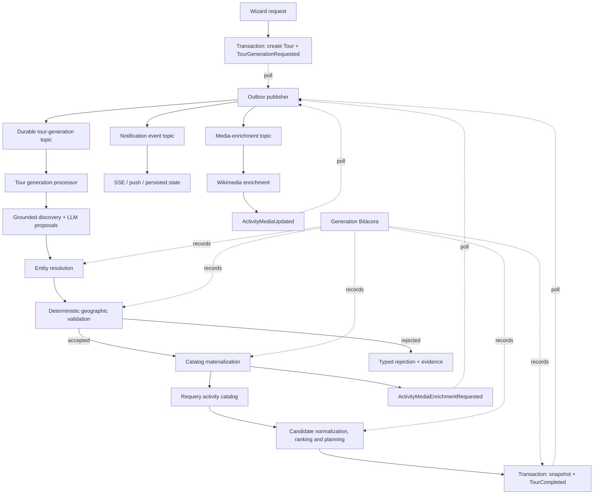

# Tour engine: geographic validation, outbox and media — implementation handoff

**Status:** Executed, hardened and verified (112 test suites passing, 0 lint errors).

**Source of truth:** `/Users/jiseruk/projects/zig-zag/.worktrees/ui-redesign`

**Branch:** `fix/acquisition-format-discovery`

**Working tree:** clean

## 1. Objective

Complete the tour-generation flow so that:

1. discovered composite activities are accepted only after deterministic geographic validation of their resolved components;
2. resolution, validation and catalog persistence are distinct stages;
3. tour generation starts through a transactional outbox event instead of an untracked fire-and-forget promise;
4. media enrichment remains asynchronous and cannot block tour completion;
5. the Bitácora exposes every material stage and outcome;
6. the architecture, sequence and operator documentation describe the code that actually ships.

This plan supersedes the external drafts `activity_images_outbox_queue_plan.md`, `activity_images_outbox_queue_plan_execution.md` and their HTML preview. Those files are useful design inputs, but they are outside the repository and contain several descriptions that do not match the current branch.

### Explicit Recorded Architectural Decisions & Deviations

- **Venue-Centric EXPERIENCE:** An `EXPERIENCE` proposal can be accepted with a single authoritative venue if it represents a venue-centric activity (e.g. specialized museum, cultural show) with verified identity within destination bounds. Multi-part experiences still require at least 2 coherent components.
- **Regional Routes & Scope:** Thematic routes spanning wider corridors are valid when the destination boundary or regional scope accommodates their anchors.
- **Outbox In-Memory Consumer Policy:** `InMemoryQueueService` strictly enforces subscriber registration on critical topics (`TourGenerationRequested`, `ActivityMediaEnrichmentRequested`) by throwing an error when no handler is registered, ensuring unhandled critical events remain retryable in `OutboxEvent`. Non-critical topics (e.g. `ActivityMediaUpdated`) are acknowledged as no-ops.
- **Media Asynchrony:** Media enrichment runs asynchronously via `ActivityMediaEnrichmentRequested` without blocking tour generation or completeness.

## 2. Non-negotiable domain rule

A canonical geographic entity and a real composite experience are different things.

A proposal such as “Caminata por el centro histórico” or “Ruta del Vino” does **not** need to resolve to one OSM object or one place ID. Its components must resolve to real geographic entities and the resulting set must satisfy deterministic rules for the proposal kind.

The LLM may discover concepts and propose entity hints. It must not be the authority that decides that the resulting geographic activity is real.

## 3. Current implementation snapshot

### 3.1 Discovery, resolution and persistence

- `ActivityProposal` already represents discovered proposals and carries `entityHints`.
- `ActivityProposalResolutionService` resolves hints against providers, decides acceptance/rejection and persists accepted activities in the same orchestration stage.
- `ResolvedEntity` contains provider identity and geometry-related data, but it is not yet a complete validation input: it lacks a consistent canonical resolved name, normalized administrative context and explicit evidence metadata.
- Rejection reasons are currently string-based and belong mainly to entity resolution. There is no typed geographic-validation result or stable reason taxonomy.
- Existing distance and containment utilities can be reused, including OSM membership and GeoJSON containment support.
- Composite materialization exists through activity families and waypoints, but there is no independent `CompositeGeographicValidationService`.

### 3.2 Current acceptance behavior by kind

- `NEIGHBORHOOD_WALK` currently requires an area hint. It does not implement the proposed fallback of three or more coherent anchors.
- `ROUTE` currently expects a route-like OSM entity/geometry. That is valid for a trace-backed route, but conflicts with accepting a component-defined thematic route such as a wine route.
- `EXPERIENCE` can currently be accepted with one venue. The proposed contract requires at least two valid, coherent components.
- The current destination boundary is strict. A regional route cannot silently use a “city plus surroundings” scope; the destination itself must provide the regional scope until that capability is explicitly implemented.

### 3.3 Tour generation, outbox and delivery

- `TourGenerationService.createTourFromWizard()` creates the tour and starts `generateTourActivities()` as a fire-and-forget promise.
- There is no current `TourGenerationRequested` producer/consumer path and no `TourGenerationProcessorService`.
- The transactional outbox already claims `PENDING` and stale `PROCESSING` rows with a lease, increments attempts, publishes the event type, and finishes in `PUBLISHED` or retries/fails with backoff.
- Therefore the real lifecycle is `PENDING -> PROCESSING -> PUBLISHED`, with retry and terminal `FAILED`; it is not `PENDING -> DISPATCHED`.
- `NotificationDeliveryService` is a queue subscriber for tour progress, terminal events and media updates. The outbox publisher must not be drawn as calling SSE or push delivery directly.
- The current in-memory queue is suitable only for local/test operation. Publishing returns before asynchronous handlers finish and can succeed with no subscribers, so outbox `PUBLISHED` is not equivalent to durable consumer acknowledgement.

### 3.4 Media enrichment

- Media enrichment already consumes `ActivityMediaEnrichmentRequested`, uses Wikimedia Commons, updates activity media state and emits `ActivityMediaUpdated` transactionally.
- Current Wikimedia lookup strategies are title search and geosearch. Google Places media/proxy and Wikidata-QID lookup are not current behavior.
- Provider/transport errors must not be converted into “not found” negative-cache entries. Only an authoritative empty result may populate the negative cache.
- No verified candidate-ranking media bonus exists in this branch. A `0.02` media bonus is a proposed policy, not a description of current code, and should not be added without a separate ranking decision.

### 3.5 Bitácora and documentation

- The current trace treats entity resolution as if it also meant persistence.
- The Bitácora does not expose an independent geographic-validation stage.
- The canonical architecture document is `docs/architecture/activity-discovery-and-tour-generation.md` and explicitly requires maintenance when the flow changes.

## 4. Target architecture

The dashed arrows represent asynchronous publication. The concrete queue implementation may remain in-memory in development, but production durability and acknowledgement semantics must be explicit.

## 5. Geographic validation contract

### 5.1 Pipeline boundaries

Use three separate outcomes:

1. **Entity resolution:** which real entities match each hint?
2. **Geographic validation:** does the resolved component set satisfy the proposal-kind contract inside the allowed destination scope?
3. **Catalog materialization:** only accepted validation results may create/update activities, families and waypoints.

`ActivityProposalResolutionService` may orchestrate these stages initially, but each stage must have its own model and testable service boundary. It must no longer equate “resolved” with “persisted.”

### 5.2 Validation result

Add a typed result with at least:

- `status`: `ACCEPTED | REJECTED`;
- `proposalKind`;
- accepted resolved component IDs and provider identities;
- computed metrics used by the decision;
- stable rejection codes;
- human-readable diagnostics for the Bitácora;
- validator/version identifier so decisions remain auditable.

Recommended stable rejection codes:

- `INSUFFICIENT_COMPONENTS`
- `UNRESOLVED_REQUIRED_COMPONENT`
- `OUTSIDE_DESTINATION_SCOPE`
- `COMPONENTS_TOO_DISPERSED`
- `AREA_NOT_GROUNDED`
- `ROUTE_GEOMETRY_NOT_GROUNDED`
- `ROUTE_COMPONENTS_NOT_COHERENT`
- `AMBIGUOUS_COMPONENT`
- `UNSUPPORTED_PROPOSAL_KIND`

Do not reuse provider failure/error codes as geographic rejection codes. A provider outage is not evidence that an activity is geographically invalid.

### 5.3 Minimum contracts by proposal kind

#### `NEIGHBORHOOD_WALK`

Accept when either:

- a real area/neighbourhood component resolves and contains or is coherently associated with the remaining components; or
- at least three resolved anchors form a coherent local cluster inside the destination scope.

The fallback threshold and cluster radius must be named configuration/constants and covered by boundary tests.

#### `EXPERIENCE`

Require at least two distinct resolved components inside the destination scope and within a configured coherence threshold. Duplicate provider identities do not count twice.

#### `ROUTE`

Represent two explicit subtypes rather than overloading one rule:

- **trace-backed route:** a real route/way/relation with usable geometry;
- **component-defined route:** multiple real ordered components whose distances and destination membership form a plausible corridor.

Do not accept a route merely because one ambiguous street/way matched. Do not require a thematic route to have one canonical OSM object.

### 5.4 Scope and metrics

- Reuse existing containment and distance utilities; consolidate units at service boundaries and name whether values are metres or kilometres.
- Destination scope comes from the resolved destination boundary already used by the engine.
- “City plus surroundings” remains out of scope unless a separately modelled regional destination or mobility scope is introduced.
- Persist or trace the exact metrics used: component count, outside-scope count, pairwise/centroid distances, route length/continuity signals and area-membership evidence.

## 6. Outbox and queue corrections

### 6.1 Start tour generation transactionally

Change `createTourFromWizard()` so the same database transaction creates:

- the `Tour` in its initial generation state; and
- one idempotently keyed `TourGenerationRequested` outbox event.

A `TourGenerationProcessorService` consumes that event and invokes generation. Remove the direct fire-and-forget generation call only after the consumer path and recovery tests exist.

### 6.2 Delivery semantics

- Keep the persisted outbox lifecycle already implemented: `PENDING`, leased `PROCESSING`, `PUBLISHED`, retry/backoff and `FAILED`.
- Publish domain event names as topics unless a deliberate topic-mapping layer is introduced.
- Notification and media services consume events from the queue; the outbox publisher only publishes.
- Add idempotency at every consumer because publication is at-least-once.
- Do not claim end-to-end durability while production uses the current in-memory queue. Choose and document either a durable broker/DB-backed consumer queue or a transactionally claimed DB worker for production.
- Define the acknowledgement boundary: an outbox row may become `PUBLISHED` only when the selected transport has durably accepted the event.

### 6.3 Failure and recovery

Cover:

- process termination after claim but before publish;
- publish success followed by process termination before marking `PUBLISHED`;
- duplicate delivery;
- no registered consumer;
- consumer failure after receipt;
- stale lease recovery;
- terminal failure visibility and operator retry.

## 7. Media enrichment corrections

- Keep media optional for tour completion and ranking unless a separate product decision changes that rule.
- Preserve documentary source, author and licence metadata end to end.
- Treat `FOUND`, `AUTHORITATIVE_EMPTY`, `RETRYABLE_FAILURE` and `PERMANENT_FAILURE` as different lookup outcomes.
- Write a negative-cache entry only for `AUTHORITATIVE_EMPTY` and retain provider + strategy isolation in the cache key.
- Keep Wikimedia title search and geosearch as the documented current providers. Add QID or Google Places only in a separately scoped increment with licensing/proxy requirements.
- Emit `ActivityMediaUpdated` in the same transaction that updates the activity media state.

## 8. Bitácora contract

The Bitácora is transversal and must reflect all material changes to the tour engine. Add or revise these stages:

1. `tour_generation_requested`
   - tour ID, request source, event ID, enqueue timestamp.
2. `entity_resolution`
   - proposals, hints, provider attempts, resolved identities, ambiguity and provider failures.
   - must not say that activities were persisted.
3. `geographic_validation`
   - kind contract, validator version, metrics, accepted/rejected components and stable reason codes.
4. `catalog_materialization`
   - created/reused activities, families and waypoints; transaction outcome.
5. existing catalog requery, normalization, feasibility, ranking, selection and completeness stages.
6. `tour_completion_published`
   - terminal transaction and outbox event identity.
7. asynchronous media state should be linked by event/activity ID without making it part of tour completeness.

Update trace DTOs, builders, serialization/copy UI and tests together. Old traces must remain readable or have an explicit migration/version rule.

## 9. Implementation increments

Each increment must leave the branch green and include its documentation delta.

### [x] Increment A — Contracts and characterization

- Characterize current proposal resolution and persistence behavior with tests.
- Extend the resolved-entity model with canonical naming, normalized admin context and evidence required by validation.
- Introduce typed validation result/reason models without changing acceptance yet.
- Record current thresholds and units.

### [x] Increment B — Deterministic geographic validator

- Implement `CompositeGeographicValidationService` using existing distance, containment and OSM membership helpers.
- Implement kind-specific policies and both route subtypes.
- Unit-test thresholds, duplicates, missing geometry, ambiguous candidates, provider failure and destination boundaries.

### [x] Increment C — Split materialization from resolution

- Make resolution return data rather than persist as a side effect.
- Validate the resolved proposal.
- Materialize only accepted results in one transaction.
- Preserve family/waypoint identity and idempotency; requery the catalog after persistence as today.

### [x] Increment D — Bitácora

- Split `entity_resolution`, `geographic_validation` and `catalog_materialization` trace stages.
- Surface stable reason codes and metrics without leaking oversized provider payloads.
- Update backend and frontend trace tests, including copy/export behavior.

### [x] Increment E — Transactional tour-generation request

- Add `TourGenerationRequested` creation to the tour-create transaction.
- Add an idempotent processor and recovery path.
- Switch off the fire-and-forget invocation after parity tests pass.
- Keep a feature flag/rollback path for one release if operationally necessary.

### [x] Increment F — Queue durability and acknowledgement

- Select the production transport and document its ownership/acknowledgement semantics.
- Add consumer idempotency keys and dead-letter/operator recovery.
- Retain the in-memory adapter only for local/test use.

### [x] Increment G — Media outcome hardening

- Separate empty results from failures.
- Prevent transient failures from poisoning the negative cache.
- Verify attribution through API DTOs and UI fallbacks.
- Do not add a ranking bonus in this increment.

### [x] Increment H — Final architecture sync and end-to-end verification

- Update all documents listed below.
- Run unit, integration, acceptance and relevant E2E suites.
- Perform one uncached live destination run and retain a sanitized Bitácora as evidence.

## 10. Required test matrix

### Geographic validation

- canonical area plus valid components;
- neighbourhood fallback with exactly 2, 3 and 4 anchors;
- duplicate anchors;
- components inside, on and outside the destination boundary;
- coherent and dispersed experiences;
- trace-backed route;
- component-defined route;
- ambiguous street/route candidates;
- regional route against city scope and regional scope;
- provider outage versus genuine unresolved component;
- deterministic repeatability for identical inputs.

### Persistence and idempotency

- rejected proposal creates no catalog records;
- accepted proposal creates/reuses the expected family, activity and waypoints once;
- retry does not duplicate records;
- partial transaction failure rolls back;
- catalog requery observes committed records.

### Outbox and processing

- tour and request event are atomic;
- duplicate `TourGenerationRequested` is harmless;
- lease recovery and retry/backoff;
- successful durable publish transitions to `PUBLISHED`;
- absent/failed consumer is observable;
- terminal tour and media events are atomic with state changes.

### Media

- title search and geosearch isolation;
- authoritative empty result populates negative cache;
- timeout/5xx/rate-limit does not populate negative cache;
- attribution and licence survive persistence and presentation;
- missing photo falls back to curated presentation without blocking the tour.

### Bitácora and UI

- all new stages serialize and render;
- acceptance/rejection metrics and reasons are visible;
- entity resolution no longer claims persistence;
- old traces remain renderable;
- terminal and media SSE events update the UI idempotently.

## 11. Documentation that must change with implementation

- `docs/architecture/activity-discovery-and-tour-generation.md`
  - canonical flow, contracts, queue semantics, validation and persistence boundaries.
- `docs/architecture/main-flow-for-dummies.md`
  - plain-language flow and failure/retry explanation.
- `docs/superpowers/specs/2026-08-20-generation-bitacora-design.md`
  - new stages, payloads, reason codes and trace compatibility.
- this plan
  - check off increments and record any accepted design deviation.

Diagrams must distinguish current state from target state. Use separate diagrams for:

1. end-to-end tour generation and geographic validation;
2. outbox lifecycle and consumer acknowledgement;
3. media enrichment and frontend update.

Do not use one overloaded sequence diagram as the only system description.

## 12. Acceptance criteria

The work is complete only when all of the following are true:

- no composite proposal is persisted before deterministic geographic validation;
- every accepted/rejected decision is reproducible from traced inputs, metrics and validator version;
- proposal-kind contracts are explicit and tested;
- tour generation can recover after process restart without relying on the original HTTP process;
- production event delivery has documented durable acknowledgement and idempotent consumers;
- media failure cannot fail or indefinitely delay a completed tour;
- negative caching cannot turn transient provider failure into a long-lived false absence;
- the Bitácora shows resolution, validation and materialization as different stages;
- canonical architecture and simplified flow documents match the implementation;
- all relevant automated suites pass and the working tree contains no unrelated changes.

## 13. Explicit non-goals

- Do not require one canonical OSM object for every composite activity.
- Do not let the LLM approve geographic validity.
- Do not implement an implicit “city plus surroundings” scope.
- Do not add Google Places photo proxying or a media ranking bonus as part of this plan.
- Do not rewrite existing outbox/media modules that already satisfy the corrected contract.
- Do not combine geographic rejection with transient provider/transport failure.

## 14. Key risks and overlaps

- **Double validation:** existing resolver/provider guards and the new validator may reject the same proposal differently. Keep provider/entity checks in resolution and cross-component rules in geographic validation.
- **Route semantics:** trace-backed and thematic routes need explicit subtype handling or the implementation will continue oscillating between one geometry and many components.
- **Identity collisions:** family/activity uniqueness must incorporate the semantic kind and stable resolved component identities where appropriate.
- **Unit drift:** existing helpers use different distance units at different boundaries. Normalize and test them.
- **Boundary quality:** administrative polygons can be missing or coarse. Trace which fallback was used; do not silently enlarge scope.
- **False delivery confidence:** the current in-memory queue cannot provide production durability even though the database outbox is durable.
- **Negative-cache poisoning:** provider exceptions currently risk becoming cached misses.
- **Trace payload growth:** store decision evidence and summaries, not unbounded raw provider responses.

## 15. First actions for the next session

1. Confirm the worktree path, branch, HEAD and cleanliness; do not switch branches.
2. Read this document completely.
3. Read `docs/architecture/activity-discovery-and-tour-generation.md` completely before changing tour-engine code.
4. Re-open the current implementations and tests for:
   - `ActivityProposal`;
   - `ActivityProposalResolutionService`;
   - `ResolvedEntity` and rejection reasons;
   - distance/containment/OSM membership utilities;
   - composite family/waypoint materialization;
   - generation trace/Bitácora builders;
   - tour creation, outbox publisher, queue adapters, notification delivery and media processor.
5. Start with Increment A. Do not begin by rewriting the outbox or by adding new media providers.
6. Before the first code change, record any divergence between this reviewed snapshot and the new HEAD.

Suggested handoff prompt:

> Continue the implementation plan in `docs/superpowers/plans/2026-08-31-tour-engine-geographic-validation-outbox-media-handoff.md` from the current `fix/acquisition-format-discovery` worktree. Verify the current HEAD and dirty state, read the canonical architecture document in full, report any drift from the plan, then implement Increment A only with tests and the required documentation delta. Preserve unrelated changes and do not add Google Places media or a ranking bonus.

## 16. Review evidence

At the reviewed commit, focused proposal-resolution and related test suites passed: 4 suites, 67 tests. This is a characterization baseline, not proof that the target architecture is implemented.

