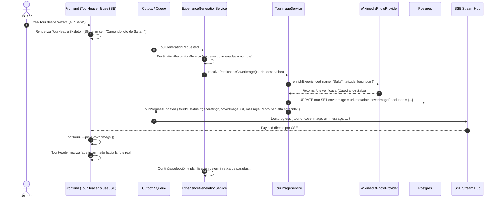

# Destination Cover Photo Asynchronous Resolution & Presentation — Design

Status: approved, implementing
Branch: `ui-redesign`
Related: `docs/architecture/activity-discovery-and-tour-generation.md`, `CLAUDE.md`, `be/src/modules/integrations/photos/`

## Context

When a tour was created from the wizard, the user navigated immediately to `/tours/:id`. While the tour was being generated in the background by the outbox processor, `tour.coverImage` remained `null` and `tour.experiences` was empty.

Because no photo was yet available, `TourHeader.tsx` fell back through `getImage(undefined)` to `CATEGORY_FALLBACK_IMAGES.default[0]`. This constant was hardcoded to an Unsplash image of the **Obelisco de Buenos Aires** (`photo-1589909202802-8f4aadce1849`). As a result, every generated tour across any destination (e.g., Salta, Bariloche, Mendoza, Madrid, Paris, Tokyo) initially showed the Obelisk of Buenos Aires in the header banner.

Furthermore, the legacy `TourImageService` attempted AI image generation (DALL-E), which was disabled via `bypass: true` (to avoid high costs and 15-second latency), leaving `tour.coverImage` unpopulated even after tour generation completed unless an experience photo existed.

## Architectural Requirements & Product Decisions

1. **Strictly Grounded, Authentic Photos**:
   - Never inject fake, generic, or mismatched photos.
   - A tour in Salta must show Salta; Bariloche must show Bariloche.
   - Hardcoded city-specific placeholders (like the Obelisco) are strictly prohibited as global fallbacks.

2. **Asynchronous Outbox Resolution (No Instant Client Guesswork)**:
   - Presentation assets are resolved through the existing durable async pipeline.
   - When `TourGenerationRequested` is processed, `ExperienceGenerationService` coordinates with `TourImageService`.
   - `TourImageService` leverages verified providers (`WikimediaPhotoProvider` with geographic/name matching, with Google Places as fallback) to obtain the primary destination landmark photo.
   - The resolved photo URL is persisted in Postgres (`Tour.coverImage`) and recorded in `tour.metadata.coverImageResolution`.

3. **Direct SSE Payload Delivery (Zero Extra HTTP Round-Trips)**:
   - Following the pattern established by `ExperienceMediaUpdated`, the outbox event `TourProgressUpdated` carries the resolved `coverImage` directly in its payload:
     ```json
     {
       "tourId": "clx...",
       "status": "generating",
       "message": "Foto de Salta obtenida",
       "coverImage": "https://upload.wikimedia.org/wikipedia/commons/..."
     }
     ```
   - The SSE stream delivers this payload to the connected client.
   - The frontend's `useSSE` hook updates `tour.coverImage` in React state immediately upon event receipt, avoiding an extraneous `GET /tours/:id` round-trip.

4. **Classic Loading Animation (Shimmer / Skeleton)**:
   - While `tour.coverImage` is pending and `isGeneratingExperiences` is true, `TourHeader` must render a classic skeleton loading animation (`TourHeaderSkeleton`).
   - The skeleton uses a smooth pulsating opacity animation (`Animated.loop`) against a dark charcoal slate palette (`#0F172A` / `#1E293B`).
   - It displays a subtle status badge with destination awareness: *"Cargando foto de {destinationName}..."*.
   - Once the SSE message delivers `coverImage`, `TourHeader` transitions smoothly via a 400ms fade-in animation (`Animated.timing`).

## Data Flow Diagram



## Failure & Edge Case Handling

1. **Destination photo unavailable**:
   - If Wikimedia Commons and Google Places find no verified photo for the destination, `coverImage` remains null.
   - When tour generation finishes, `TourHeader` falls back to the first available documentary photo across all materialized experiences (`tour.experiences`).
   - If no experience has photos, a neutral, non-city-specific travel landscape is used (never a hardcoded landmark of another city).
2. **SSE disconnect / reconnection**:
   - Since `coverImage` is committed to the database in Postgres, any HTTP reconciliation or manual screen refresh immediately returns the persisted `coverImage`.
